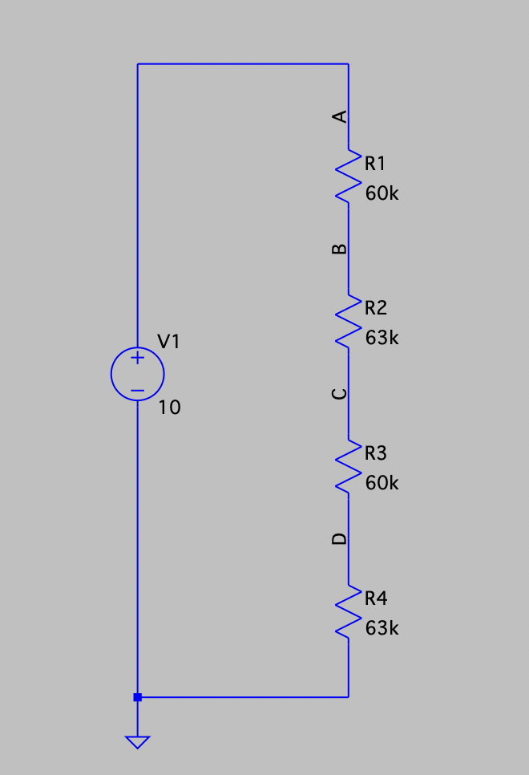
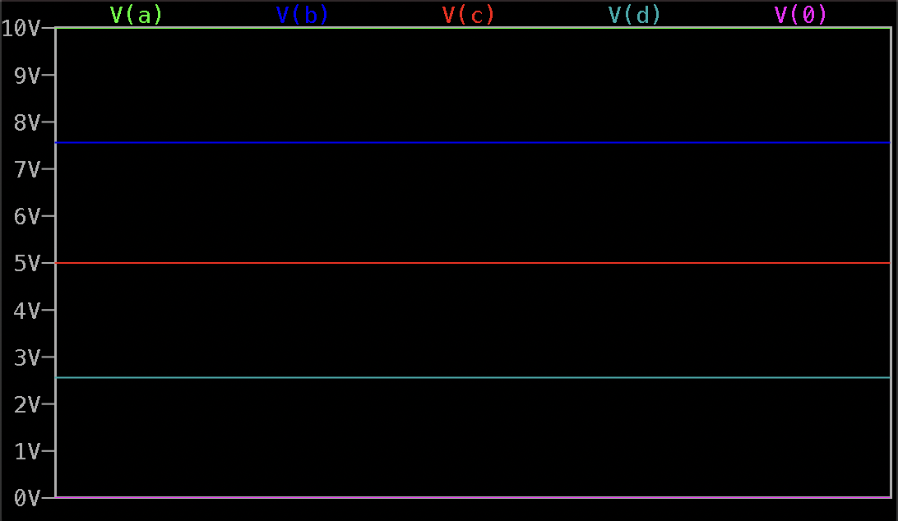
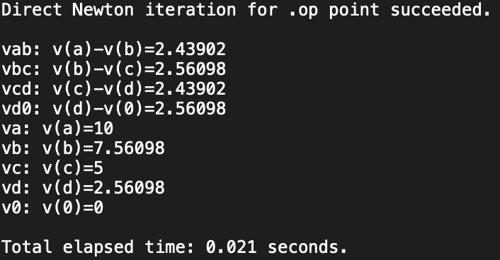
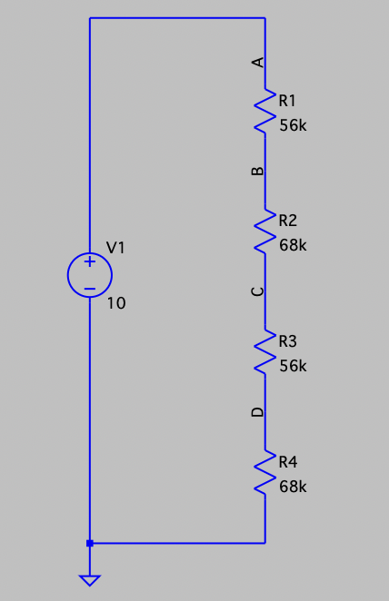
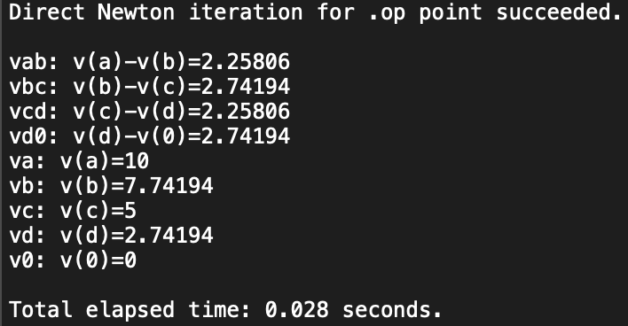
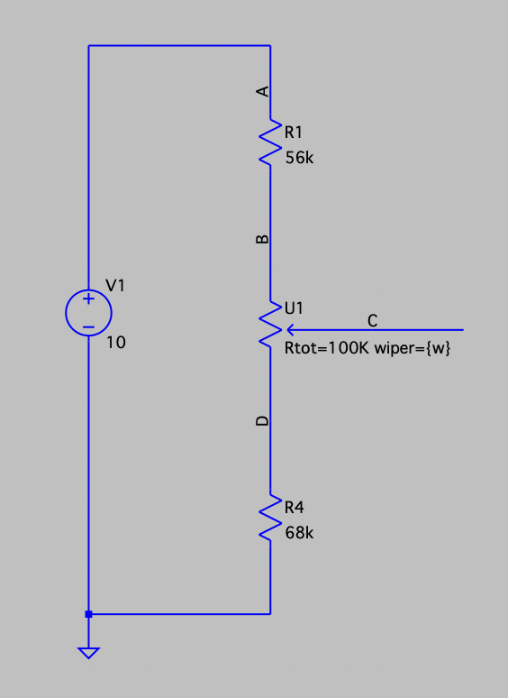
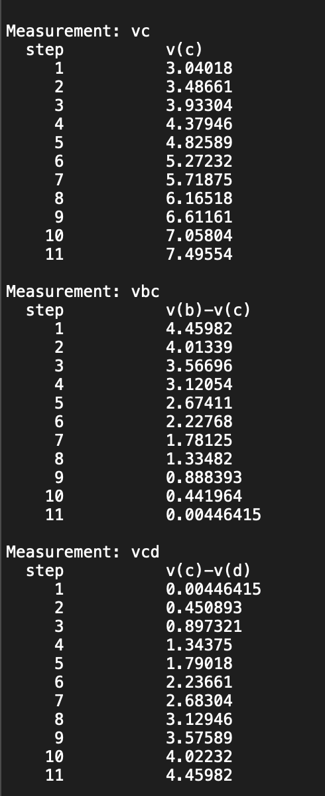
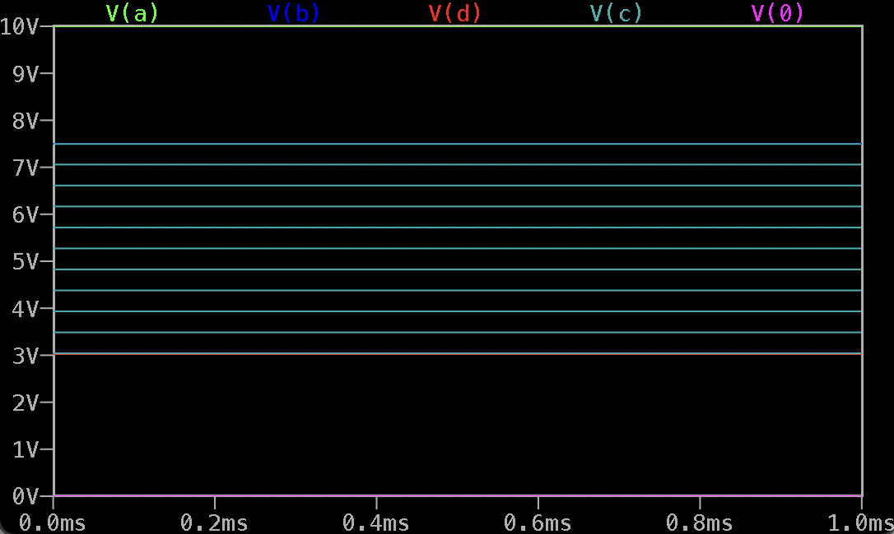

# DC Circuits - Voltage Divider

## Tools

- Breadboard with 10 V DC supply
- Resistors (E12 series)
- PicoScope 2205A
- LTspice

## Objective

- Calculate the voltages on tapping points **B, C, and D** of a resistor voltage divider.
- Verify calculations with **LTspice simulation**.
- Replace resistor values with the closest **E12 series** values and observe the difference.
- Replace **R2 and R3** with a potentiometer (100kΩ, closer to R2+R3) and observe the adjustment range.
- Verify simulation results experimentally with a **PicoScope**.

## Device Under Test (DUT)

The DUT is a 4-resistor voltage divider with tapping points B, C, and D, supplied from Vs = 10 V DC.

## Schematic

**Figure:** Tapped voltage divider schematic (nodes A–D and ground, Vs = 10 V).



## Procedure

First, voltages at nodes B, C, and D were calculated. Then, the circuit was simulated in LTspice with base and E12 resistor values, and also with a potentiometer replacing R2 and R3. Finally, the circuit was built and voltages were measured with PicoScope, including the potentiometer test.

## Calculations

**Given values (base case):**
Vs = 10 V, R1 = 60 kΩ, R2 = 63 kΩ, R3 = 60 kΩ, R4 = 63 kΩ

**Total resistance:**  
Rt = R1 + R2 + R3 + R4 = 60 kΩ + 63 kΩ + 60 kΩ + 63 kΩ = 246 kΩ

**Current (same in series):**  
I = Vs / Rt = 10 V / 246 kΩ = 40.65 &micro;A

**Node voltages:**  
Va = 10 V  
Vb = Va − I \* R1 = 10 − (40.65 µA × 60 kΩ) = 7.56 V  
Vc = Vb - I \* R2 = 7.56 - (40.65 µA × 63 kΩ) = 5.00 V  
Vd = Vc - I \* R3 = 5.00 - (40.65 µA × 60 kΩ) = 2.56 V

**Voltage drops:**  
Vab = I \* R1 = Va - Vb = 10 - 7.56 = 2.44 V  
Vbc = I \* R2 = Vb - Vc = 7.56 - 5.00 = 2.56 V  
Vcd = I \* R3 = Vc - Vd = 5.00 - 2.56 = 2.44 V  
Vd0 = I \* R4 = Vd - V0 = 2.56 - 0 = 2.56 V

---

## LTspice Simulation (Base Values)

**LTspice setup (base case):**

```
.op
.tran 1m

* Voltage drops
.meas Vab param V(a)-V(b)
.meas Vbc param V(b)-V(c)
.meas Vcd param V(c)-V(d)
.meas Vd0 param V(d)-V(0)

* Node voltages
.meas Va  param V(a)
.meas Vb  param V(b)
.meas Vc  param V(c)
.meas Vd  param V(d)
.meas V0  param V(0)
```

**Expected operating point (from .op):**

```
Va ≈ 10.00 V
Vb ≈ 7.56 V
Vc = 5.00 V
Vd ≈ 2.56 V
V0 = 0.00 V
```

**Waveform viewer:**  


**SPICE Error Log results:**  


---

## Calculations (E12 Values)

**Given values (E12 case):**
Vs = 10 V, R1 = 56 kΩ, R2 = 68 kΩ, R3 = 56 kΩ, R4 = 68 kΩ

**Total resistance:**  
Rt = R1 + R2 + R3 + R4 = 56 kΩ + 68 kΩ + 56 kΩ + 68 kΩ = 248 kΩ

**Current (same in series):**  
I = Vs / Rt = 10 V / 248 kΩ ≈ 40.32 µA

**Node voltages:**  
Va = 10 V  
Vb = Va − I·R1 = 10 − (40.32 µA × 56 kΩ) ≈ 7.74 V  
Vc = Vb − I·R2 = 7.74 − (40.32 µA × 68 kΩ) ≈ 5.00 V  
Vd = Vc − I·R3 = 5.00 − (40.32 µA × 56 kΩ) ≈ 2.74 V

**Voltage drops:**  
Vab = I·R1 ≈ 2.26 V  
Vbc = I·R2 ≈ 2.74 V  
Vcd = I·R3 ≈ 2.26 V  
Vd0 = I·R4 ≈ 2.74 V

---

## LTspice Simulation (E12 Values)

**Schematic:**  


**Waveform viewer:**  


**SPICE Error Log results:**  


---

## Potentiometer Replacement (R2 + R3)

**Goal.** Replace R2 and R3 with a potentiometer and observe the adjustment range at node C.

**Choice of value.** E12 case gives R2 + R3 = 68 kΩ + 56 kΩ = 124 kΩ → closer to **100 kΩ** than 10 kΩ. Use a 100 kΩ pot.

**Connections.** Pot between **B (top)** and **D (bottom)**, **wiper = C**.

### LTspice implementation note

LTspice does not provide a potentiometer component by default.
For this simulation, an external potentiometer model (`pot.sub`) was added to the local LTspice library and included using:

```spice
.include pot.sub
```
> Note: `pot.sub` is not included in this repository.  
> It was added locally from an external LTspice potentiometer library (see course instructions / external library).  
> If you want to reproduce the simulation, install `pot.sub` into your LTspice `lib/sub/` folder and keep `.include pot.sub` in the schematic.

The wiper position is defined by a parameter **w** in the range 0…1.
To avoid numerical issues at the extremes, the sweep range was limited to **0.001–0.999**.

**Schematic (with pot):**  


**LTspice setup (pot included):**

```spice
* Potentiometer model include
.include pot.sub

* Wiper parameter sweep (0…1, avoid exact 0/1)
.param w=0.5
.step param w 0.001 0.999 0.1

* DC operating point
.op

* Transient for plotting stepped results
.tran 1m

* Key measurements
.meas Vc   param V(c)
.meas Vbc  param V(b)-V(c)
.meas Vcd  param V(c)-V(d)
```

**SPICE Error Log results:**  


**Waveform viewer (voltages vs. wiper position w):**  


**Observation.**  
In the simulation, the voltage at node C changes from about **3.0 V (near D)** up to about **7.5 V (near B)**. This covers the full range between nodes D and B, as shown in the log and waveforms.

## Measured Values

Measured with PicoScope.

| Node / Drop | Calculated / Simulated (V) | Measured (V) |
| ----------- | -------------------------- | ------------ |
| Va          | 10.00                      | 9.990        |
| Vb          | 7.74                       | 7.448        |
| Vc          | 5.00                       | 4.671        |
| Vd          | 2.74                       | 2.551        |
| Vab         | 2.26                       | 2.487        |
| Vbc         | 2.74                       | 2.768        |
| Vcd         | 2.26                       | 2.091        |
| Vd0         | 2.74                       | 2.550        |

**Current (from node D):**  
I = V(D) / R4 = 2.551 V / 68 kΩ = 37.5 µA

**Potentiometer (Node C range):**

| Measurement | Vc min (V) | Vc max (V) |
| ----------- | ---------- | ---------- |
| Simulation  | 3.04       | 7.49       |
| Measured    | 2.98       | 7.19       |

Measured values are slightly lower but close to simulation, confirming the expected voltage adjustment range of the potentiometer.

## Evaluation

The measured values are a bit lower than in the simulation. The difference is only a few tenths of a volt because of resistor tolerance, power supply not being exactly 10 V, and normal measurement error. In general, the voltage divider worked as expected.
