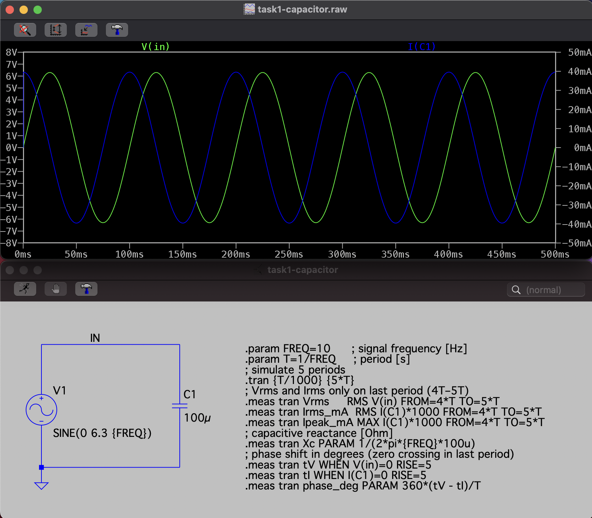
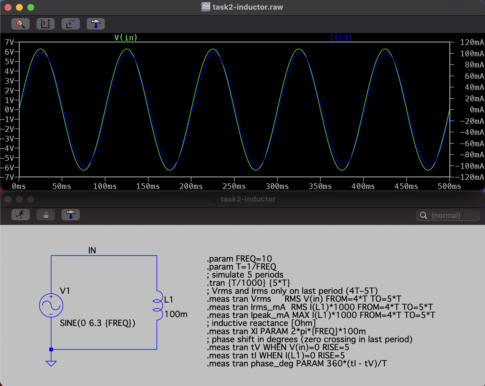
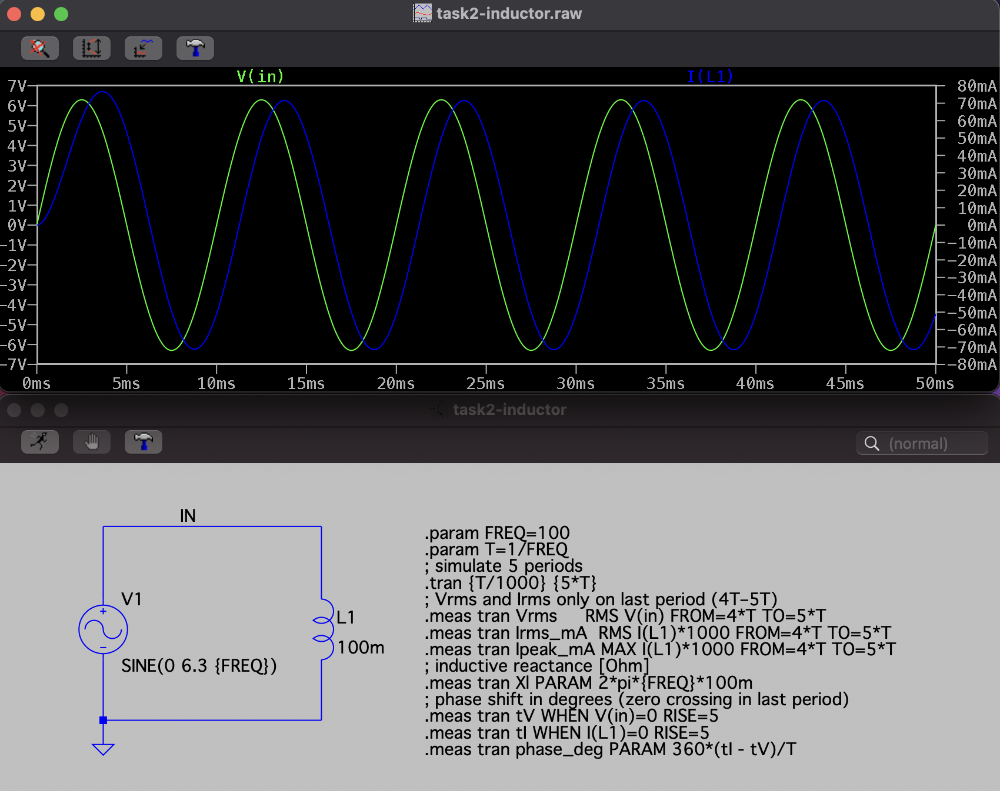
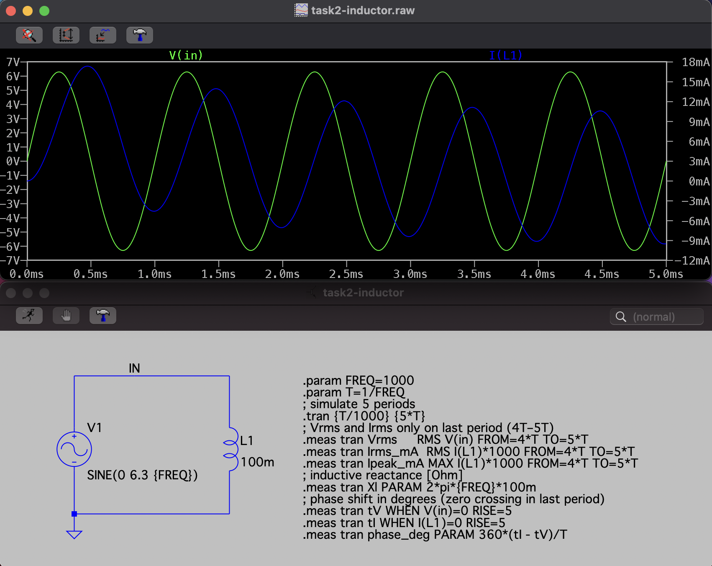
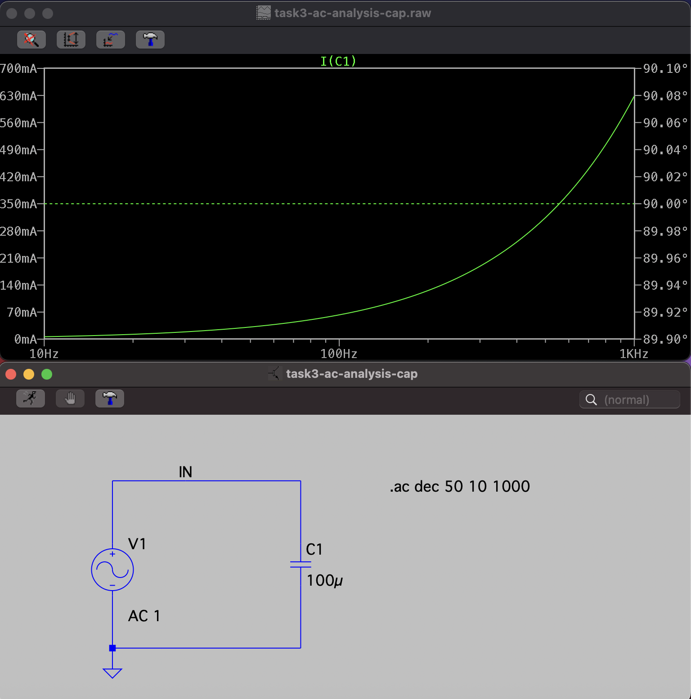
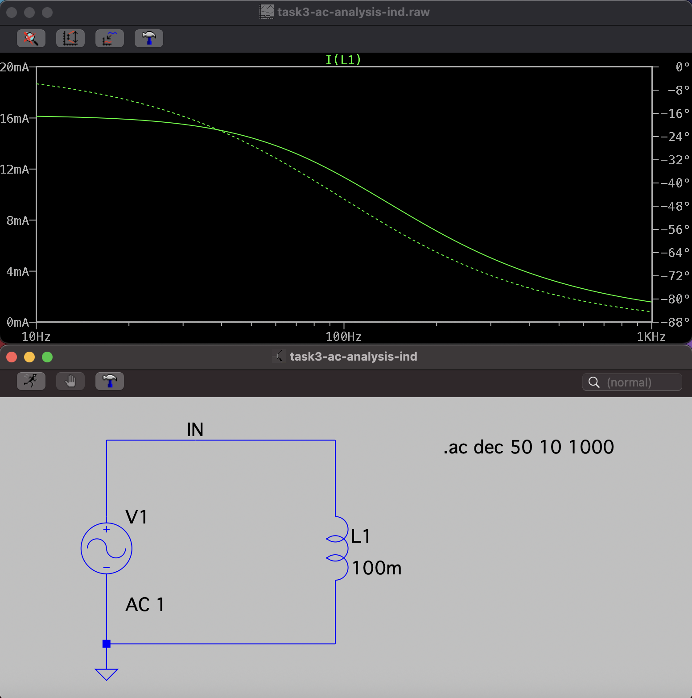
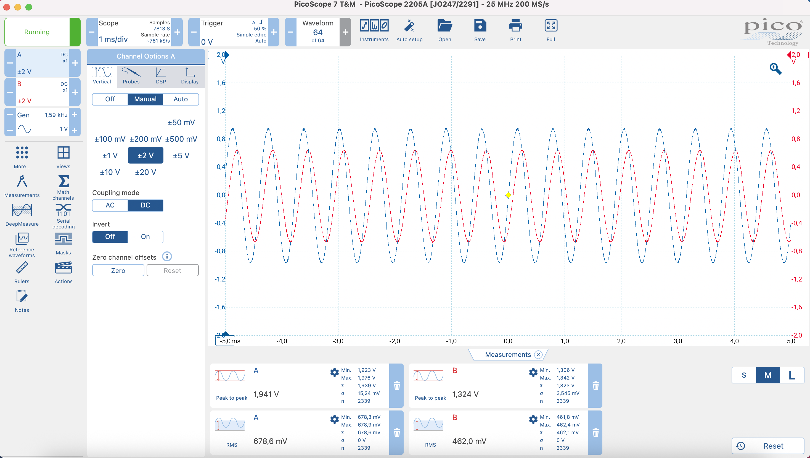

# AC Circuits

## Tools

- PicoScope 2205A
- Breadboard (for assembling circuits)
- Capacitor: 100 µF (Task 1)
- Inductor: 100 mH (Task 2)
- Resistors: 10 kΩ and Capacitor: 10 nF (Task 4)
- LTspice

## Task 1: Capacitor Reactance

### Calculation

In this task we study how a capacitor resists AC at different frequencies.  
We calculate the capacitive reactance $X_C$ and the expected current, so later we can compare with simulation.

**Formulas**  
Capacitive reactance: $X_C = \frac{1}{2 \pi f C}$

Expected current: $I_{\mathrm{rms}} = \frac{V_{\mathrm{rms}}}{X_C}, \qquad I_{\mathrm{peak}} = \frac{V_p}{X_C}$

Expected phase: $\varphi = -90^\circ \quad \text{(voltage lags current by 90°)}$

**Given**  
Capacitor: $C = 100\,\mu\text{F} = 100 \times 10^{-6}\,\text{F}$  
Frequencies: $f \in \{10,\,100,\,1000\}\ \text{Hz}$  
AC source amplitude (peak): $V_p = 6.3\ \text{V}$ <!-- last two digits “63” → 6.3 V -->

$V_{\text{rms}} = \frac{V_p}{\sqrt{2}} \approx 4.45\ \text{V}$

| Frequency (Hz) | Xc (Ω) | Irms (mA) | Ipeak (mA) |
| -------------- | ------ | -------------------- | --------------------- |
| 10             | 159.15 | 27.96                | 39.59                 |
| 100            | 15.92  | 279.52               | 395.73                |
| 1000           | 1.59   | 2789.74              | 3962.26               |

### Simulation

$V_{\mathrm{rms}} \approx 4.45\ \text{V}$ — matches theoretical source value.  
Phase shift $\varphi \approx 90^\circ$ — current leads voltage, as expected for a capacitor.

| Frequency (Hz) | Xc (Ω) | Irms (mA) | Ipeak (mA) |
| -------------- | ------ | -------------------- | --------------------- |
| 10             | 159.16 | 27.98                | 39.59                 |
| 100            | 15.92  | 279.83               | 395.85                |
| 1000           | 1.59   | 2798.31              | 3958.49               |

### Observations

The simulated values match the calculations.  
Small differences come only from rounding and tool accuracy.

## Task 2: Inductor Reactance

### Calculation

We compute inductive reactance $X_L$ and expected current for later comparison with simulation.

**Formulas**

Inductive reactance: $X_L = 2\pi f L$

Expected current: $I_{\mathrm{rms}} = \dfrac{V_{\mathrm{rms}}}{X_L}, \quad I_{\mathrm{peak}} = \dfrac{V_p}{X_L}$

Expected phase: $\varphi = +90^\circ$ (voltage leads current)

**Given**  
Inductor: $L = 100\ \text{mH} = 0.1\ \text{H}$  
Frequencies: $f \in \{10,\,100,\,1000\}\ \text{Hz}$  
AC source amplitude (peak): $V_p = 6.3\ \text{V}$ <!-- last two digits “63” → 6.3 V -->

$V_{\text{rms}} = \frac{V_p}{\sqrt{2}} \approx 4.45\ \text{V}$

| Frequency (Hz) | XL (Ω) | Irms (mA) | Ipeak (mA) |
| -------------- | ----------------- | -------------------- | --------------------- |
| 10             | 6.28              | 708.60               | 1003.18               |
| 100            | 62.83             | 70.83                | 100.27                |
| 1000           | 628.32            | 7.08                 | 10.03                 |

### Simulation

For the simulation, instead of an ideal inductor, a real Coilcraft model was used. Its parameters are:

- Inductance: 100 mH (set value)
- Series resistance: 61.7 Ω
- Parallel resistance (leakage): 9.42 MΩ

Because of the series resistance, the inductor acts like a resistor + inductor in series, not a pure inductor.

- At 10 Hz: reactance is only ~6 Ω, much smaller than 61.7 Ω. The resistance dominates, so the current is much smaller than the ideal calculation, and the phase shift is only ~6°.

- At 100 Hz: reactance is ~63 Ω, about the same as the resistance. The current is still smaller than in the ideal case, and the phase shift is ~45°.

- At 1000 Hz: reactance is ~628 Ω, much bigger than the resistance. The current becomes very small (limited mainly by reactance), and the phase shift rises to ~80°.

So compared to the ideal inductor, the current is always smaller because of the series resistance, and the phase shift depends on frequency instead of staying at 90°.

$V_{\mathrm{rms}} \approx 4.45\ \text{V}$ — same as in calculation, since the source settings are identical.

| Frequency (Hz) | XL (Ω) | Irms (mA) | Ipeak (mA) | Phase (°) |
| -------------- | ----------------- | -------------------- | --------------------- | --------- |
| 10             | 6.28              | 71.85                | 101.51                | 5.82      |
| 100            | 62.83             | 50.59                | 71.51                 | 45.54     |
| 1000           | 628.32            | 7.08                 | 10.60                 | 80.17     |

## Task 3: Frequency Response

### Capacitor Frequency Response

The capacitor current increases with frequency.  
This matches theory: $I = \frac{V}{X_C}$, and $X_C = \frac{1}{2 \pi f C}$ decreases as $f$ increases.

### Inductor Frequency Response

The inductor current decreases as frequency increases.  
This is because $X_L = 2 \pi f L$ grows with $f$, so the inductor resists current more.

In simulation a real Coilcraft inductor was used with series resistance.  
At low frequency this resistance makes the current higher than in the ideal case.  
At high frequency the reactance dominates and the current is very small.

In the plot the **solid line** shows the current magnitude (falling with frequency).  
The **dashed line** shows the phase (moving from ~0° at low frequency toward −90° at high frequency).

### Observations

Capacitor → current rises with frequency.  
Inductor → current falls with frequency.

In real inductors, series resistance reduces the phase shift from the ideal −90°,  
so the phase was clearly less than 90° at low frequencies.

## Task 4: RC Low-pass Filter

### Design

In the lab we use a real signal generator (PicoScope AWG) with 600 Ω output impedance.  
To avoid this affecting the results, we add a much larger series resistor (10 kΩ).  
Together with a capacitor this forms an RC low-pass filter.

**Formulas**

Corner frequency:
$f_c = \frac{1}{2\pi R C}$

Capacitor value for a given corner frequency:
$C = \frac{1}{2\pi R f_c}$

Attenuation (in decibels):
$A = 20 \log_{10}\!\left(\dfrac{V_\text{out}}{V_\text{in}}\right)$

At the cutoff frequency of a low-pass RC circuit, the output voltage drops to about 70.7% of the input (that is, $V_\text{out}/V_\text{in}=0.707$), corresponding to the −3 dB point.

### Given

Signal generator: PicoScope 2205A AWG, output impedance 600 Ω  
Resistor: $R = 10\ \text{k}\Omega$  
Corner frequency (from assignment): $f_c = 1.59\ \text{kHz}$

### Calculations

$C = \dfrac{1}{2 \pi R f_c} = 10.014822\ \text{nF} \approx 10.0\ \text{nF}$

### Measurements

The PicoScope AWG was set to a 1.59 kHz sine, ~1 V RMS.  
Channel A measured the input (Vin), Channel B measured the output (Vout) across the capacitor.  
Measurements were taken as RMS values.

With $V_\text{in} = 0.678\ \text{V}$ and $V_\text{out} = 0.462\ \text{V}$:

The measured voltage ratio is:
$V_\text{out}/V_\text{in} = 0.462 / 0.678 = 0.68.$

$A = 20 \log_{10}\!\left(\dfrac{0.462}{0.678}\right) \approx -3.33\ \text{dB}$

| Frequency (Hz) | Vin (Vrms) | Vout (Vrms) | Vout/Vin | Attenuation (dB) |
| -------------- | ---------- | ----------- | -------- | ---------------- |
| 1590           | 0.678      | 0.462       | 0.68     | −3.33            |

### Observations

The measured attenuation at 1.59 kHz is about −3.3 dB, which is close to the expected −3 dB corner frequency of the RC filter.  
The small deviation from the theoretical value can be explained by the signal generator’s internal output resistance (~600 Ω), which adds to the series resistor (10 kΩ). This increases the total resistance to about 10.6 kΩ and slightly lowers the actual cutoff frequency (to around 1.5 kHz).  
As a result, the measurement taken at 1.59 kHz shows a bit higher attenuation (−3.3 dB instead of −3.0 dB) and a slightly smaller voltage ratio (0.68 instead of 0.707), both consistent with theoretical expectations.
