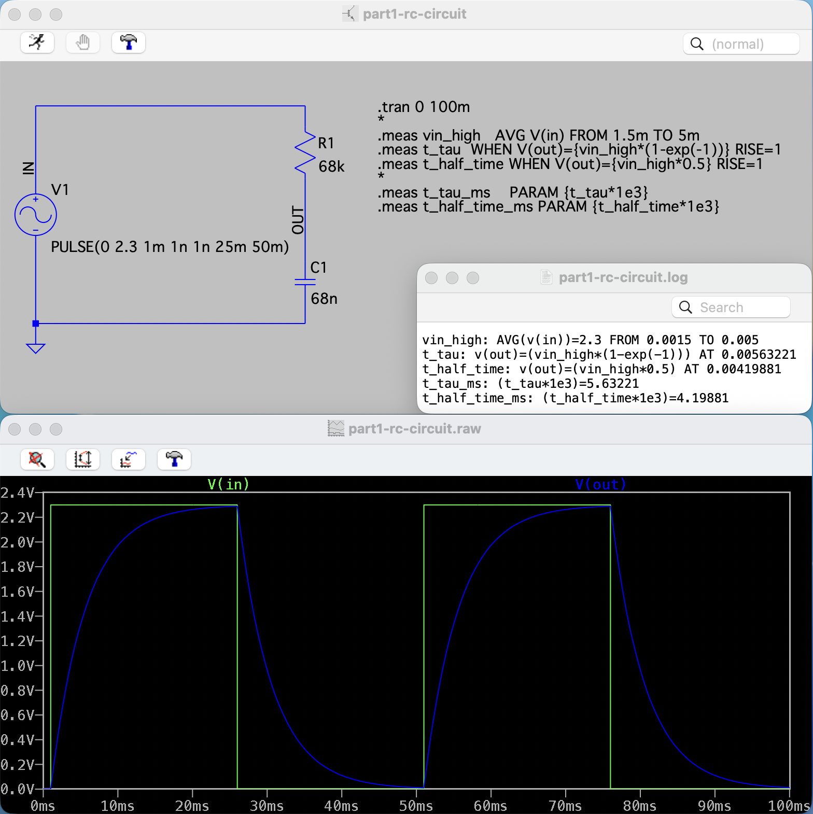
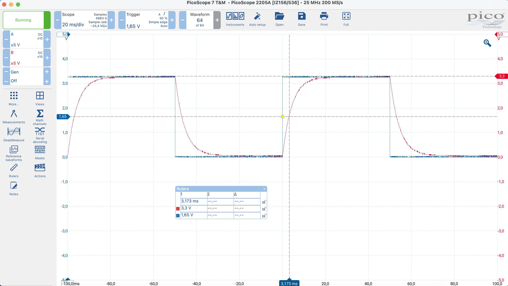
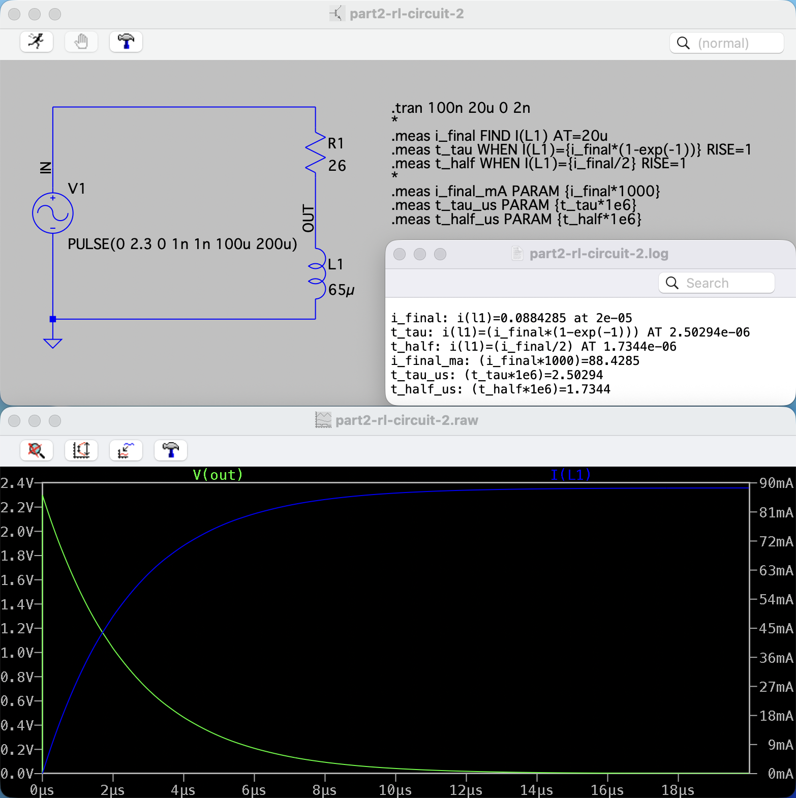

# RC and RL Step Response

**Tools:** LTspice, PicoScope 2205A, ESP32‑C6

---

## Part 1: RC Circuit – Step Response

**Given:**  
R = 68 kΩ (rounded from 73 kΩ, E12 series)  
C = 68 nF (rounded from 61 nF, E6 series)  
Step voltage: 2.3 V starting at 1 ms

### Theory

For an RC circuit with a step input, the capacitor voltage follows an exponential charging curve:

$$
V_C(t) = V_{\text{step}} \left(1 - e^{-t/RC}\right)
$$

**Time constant**:

$$
\tau = RC
$$

**Half-time** (time to reach 50% of final value):

$$
t_{\frac{1}{2}} = \tau \ln 2
$$

### Theoretical values

$$
\tau = R \cdot C = 68\,000 \cdot 68 \times 10^{-9} = \mathbf{4.624 \,\text{ms}}
$$

$$
t_{\frac{1}{2}} = \tau \ln 2 \approx \mathbf{3.20 \,\text{ms}}
$$

### Simulation

### Setup

- R = 68 kΩ
- C = 68 nF
- Step input: 0 V → 2.3 V, starting at 1 ms

### Results



**Measured (.meas, LTspice):**

- Half-time: **3.199 ms** (adjusted for 1 ms delay)
- Time constant: **4.632 ms** (adjusted for 1 ms delay)

### Conclusion

Simulation agrees with theory after accounting for the 1 ms input delay.

### Measurement

Step signal was generated with ESP32-C6.  
GPIO toggled at 50 ms HIGH / 50 ms LOW using FreeRTOS:

```c
#define STEP_PIN GPIO_NUM_8

void app_main(void)
{
    gpio_set_direction(STEP_PIN, GPIO_MODE_OUTPUT);

    while (1)
    {
        gpio_set_level(STEP_PIN, 1);
        vTaskDelay(50 / portTICK_PERIOD_MS);

        gpio_set_level(STEP_PIN, 0);
        vTaskDelay(50 / portTICK_PERIOD_MS);
    }
}
```

### Setup

ESP32-C6 generated a 10 Hz square wave (50 ms HIGH, 50 ms LOW) at 3.3 V.  
Probes were set to x10 to avoid loading effects with the 68 kΩ resistor.  
Simulation used 2.3 V, lab 3.3 V — this does not affect τ.



### Results

Measured half-time: **3.173 ms** (at 1.65 V, half of 3.3 V).  
Theoretical half-time: **3.20 ms**.

### Conclusion

Measured and theoretical half-times match closely.  
Small differences come from probe settings and supply voltage.

---

## Part 2: RL Circuit – Step Response

**Given:**  
R = 26 Ω  
L = 65 µH  
Step input: 0 V → 2.3 V (at 0 ms)

### Theory

When a step voltage is applied to an RL circuit, the inductor current rises exponentially:

$$
I_L(t) = I_{\text{final}} \left(1 - e^{-t/\tau}\right)
$$

The **time constant** $\tau$ determines how quickly the current builds up:

$$
\tau = \frac{L}{R}
$$

The **half-time** is the time it takes for the inductor current to reach half of the final current:

$$
t_{\frac{1}{2}} = \tau \ln 2
$$

### Theoretical values

$$
I_{\text{final}} = \frac{V}{R} = \frac{2.3}{26} \approx \mathbf{88.5 \,\text{mA}}
$$

$$
\tau = \frac{L}{R} = \frac{65\,\mu\mathrm{H}}{26\,\Omega} = \mathbf{2.5\,\mu\mathrm{s}}
$$

$$
t_{\frac{1}{2}} = \tau \ln 2 \approx 1.73\,\mu\mathrm{s}
$$

### Simulation

### Setup

- R = 26 Ω
- L = 65 µH
- Step input: 0 V → 2.3 V

### Results



The waveform shows inductor current `I(L1)` rising exponentially to about **88.4 mA**, while the inductor voltage `V(L)` drops from **2.3 V** to 0.  
`.meas` confirms: I_final ≈ **88.4 mA**, τ ≈ **2.5 µs**.

**Measured (.meas, LTspice):**

- Final current: **88.43 mA** (i_final @ 20 µs)
- Half-time: **1.734 µs** (t_half)
- Time constant: **2.503 µs** (t_tau)

### Conclusion

Measured values agree with theory:  
I_final = 88.5 mA and τ = 2.5 µs.
