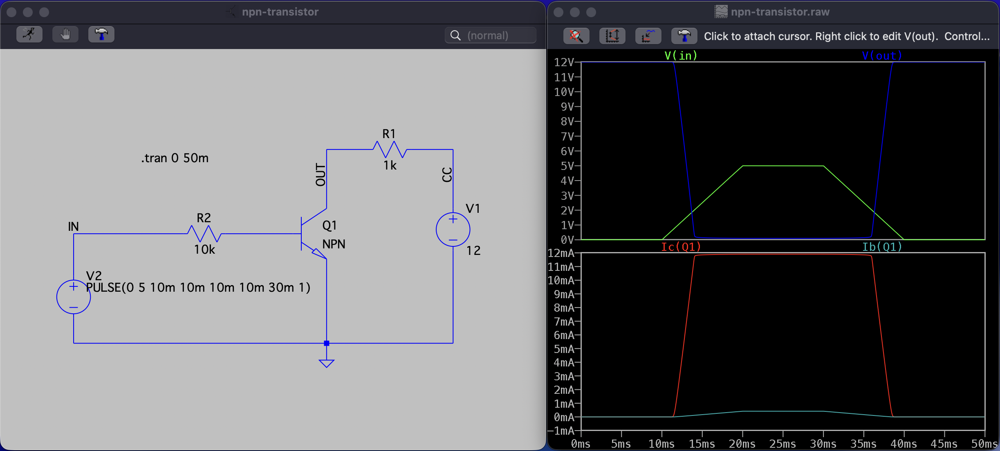
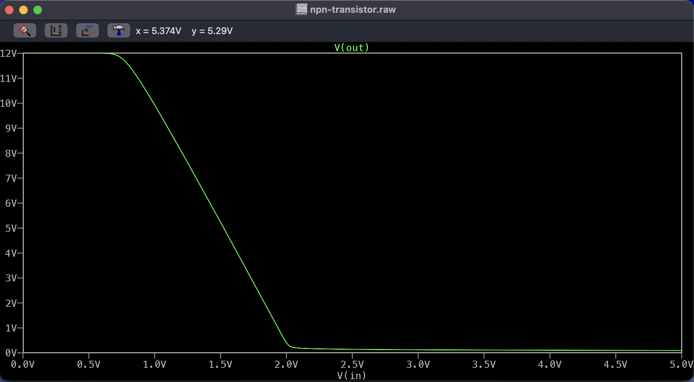
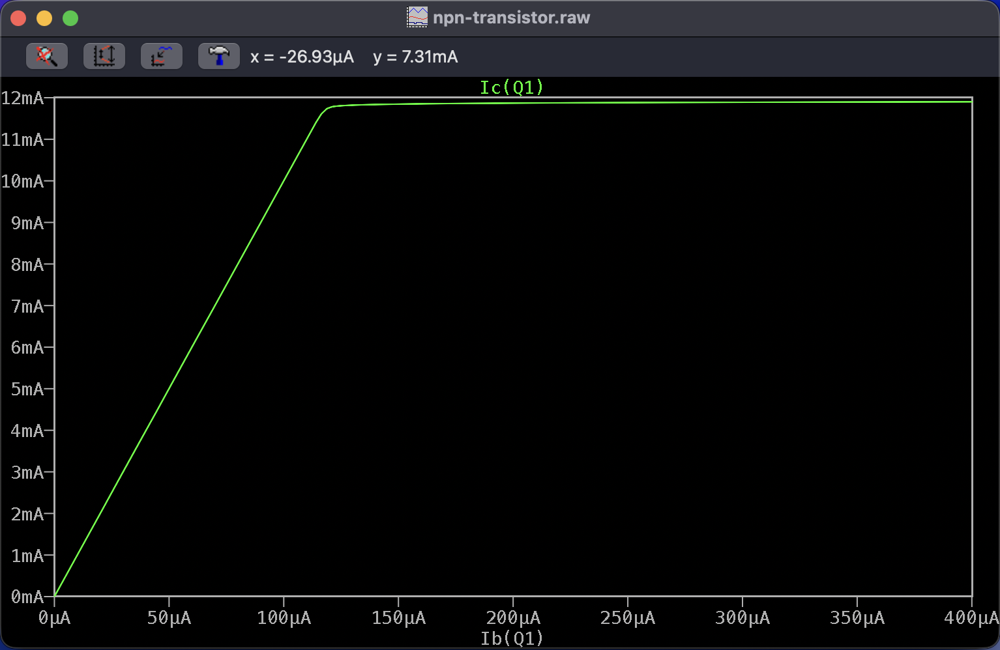
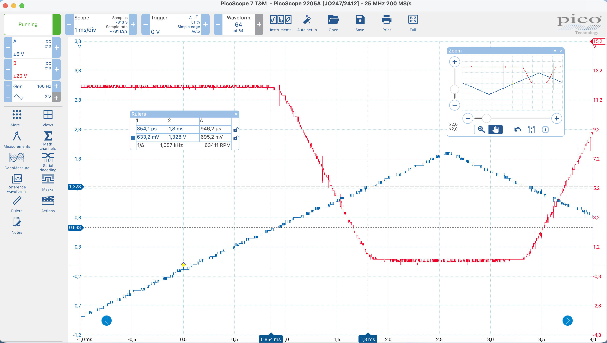
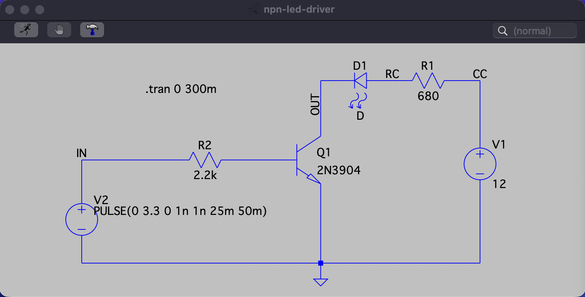
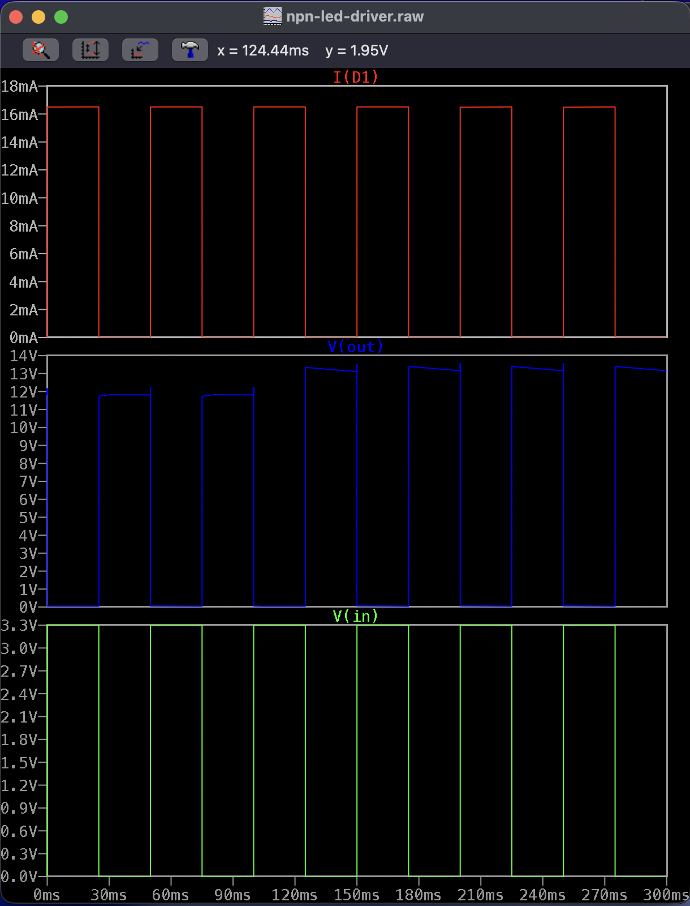
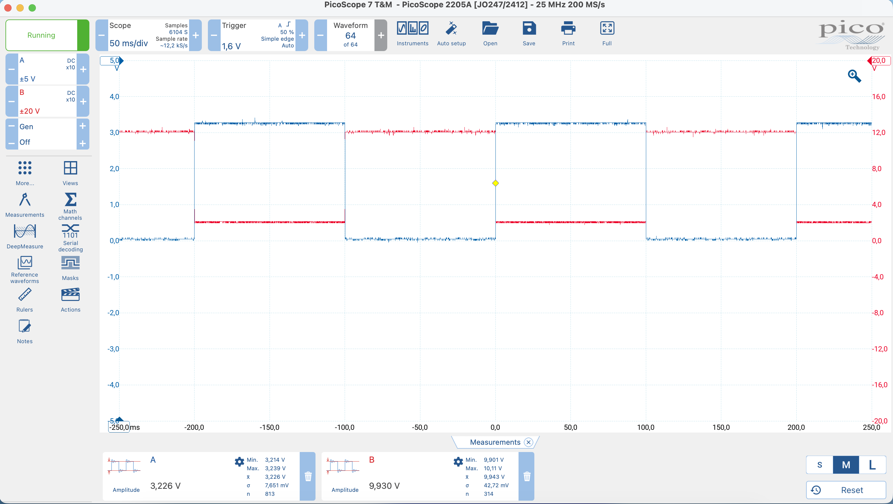
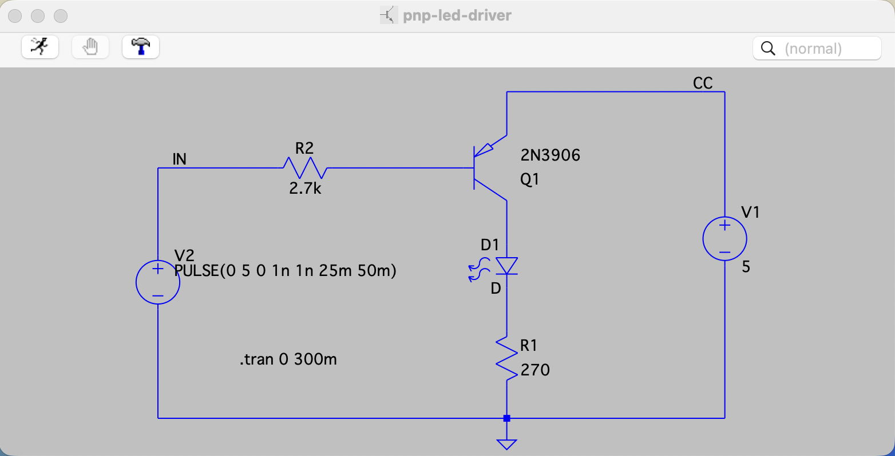
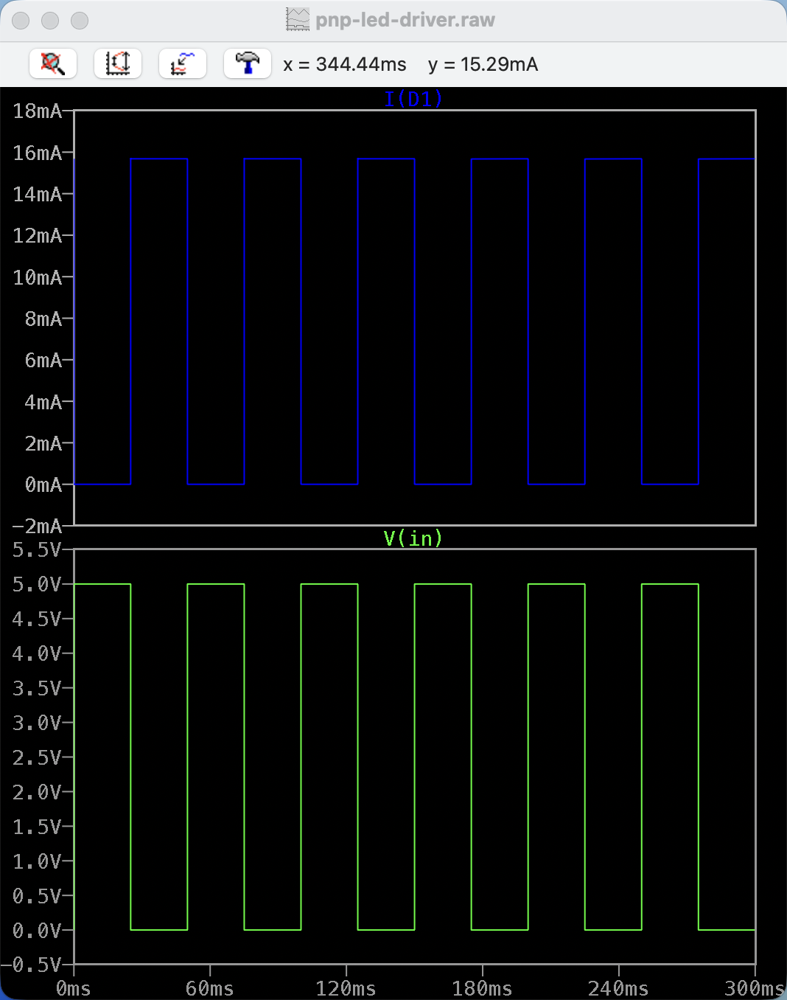

# Transistor Switching and Inverters

**Tools:** LTspice, PicoScope 2205A, ESP32-C6

---

## NPN Transistor Characteristic: Transient Simulation

In this part we built and tested a simple NPN transistor circuit with RC = 1 kΩ, RB = 10 kΩ, and VCC = 12 V.  
The input Vin was a slow ramp from 0 V to 5 V (like turning a potentiometer).  
With transient analysis we looked at how voltages and currents change over time.

### Circuit, Voltages and Currents

  
_Figure 1. LTspice schematic (left) and transient plots (right). Top: input Vin and output Vout. Bottom: base current Ib and collector current Ic._

Notes:

- When Vin < 0.6 V → Ib ≈ 0, Ic ≈ 0, transistor is off, Vout ≈ 12 V.
- When Vin ~0.7–2 V → Ib grows, Ic rises, Vout goes down → active region.
- When Vin > 2 V → Ic stays about 12 mA, Vout ≈ 0.2 V, transistor is saturated.

## Vout(Vin) Characteristic

The transfer curve of the NPN transistor was made by plotting Vout as a function of Vin.

  
_Figure 2. Vout versus Vin. The curve shows: cutoff (Vout ≈ 12 V at Vin < 0.6 V), active region (fast drop of Vout for Vin ~0.7–2 V), and saturation (Vout ≈ 0.2 V at Vin > 2 V)._

## Ic(Ib) Characteristic

The relation between collector current Ic and base current Ib was obtained from the transient simulation.

  
_Figure 3. Collector current Ic versus base current Ib. The curve is linear in the active region (Ic ≈ β·Ib) and flattens out when the transistor enters saturation (Ic limited by RC and VCC)._

### Measurements (NPN)

In the lab the circuit was built with RC = 1 kΩ, RB = 10 kΩ, transistor 2N3904, and VCC = 12 V.  
The input signal was generated using PicoScope 2205A AWG (100 Hz, 2 V amplitude, triangular waveform).  
Probes: CH A → Vin (after RB), CH B → Vout (after RC, at collector).

  
_Figure 4. PicoScope screenshot showing Vin (CH A) and Vout (CH B). Cursors mark the transition points._

Measured key points:

| Point / Region                       | Vin (V, measured) | Vout (V, measured) | Notes                                     |
| ------------------------------------ | ----------------- | ------------------ | ----------------------------------------- |
| Cutoff (just before conduction)      | < 0.6             | ≈ 12               | Transistor off, no base/collector current |
| Knee (start of active region)        | ≈ 0.633           | 11–12              | Vout begins to drop                       |
| Active (between knee and saturation) | ~0.7–1.3          | ~11 → 0.3          | Transition region, Vout falls steeply     |
| Saturation (Vout low, transistor on) | ≈ 1.328           | 0.2–0.3            | Transistor saturated, Ic limited by RC    |

**Conclusion:**  
The measured transition points (~0.63 V at knee and ~1.33 V at saturation) agree well with the simulation results.  
This confirms the expected transistor behavior: cutoff below ~0.6 V, active region between ~0.7–1.3 V, and saturation above ~1.3 V input.

### Measurements (PNP)

In the lab the circuit was rebuilt with **PNP 2N3906**, **RC = 1 kΩ**, **RB = 10 kΩ**, and **VCC = –12 V**.  
Input signal: **PicoScope 2205A AWG**, **Triangle**, **100 Hz**, **±2 V** (–2 … +2 V).  
Probes: **CH A → Vin** (after RB), **CH B → Vout** (at collector). Grounds → GND.

  
_Figure 5. PicoScope screenshot showing Vin (CH A) and Vout (CH B). Cursors mark knee and saturation._

**Measured key points:**

| Point / Region                 | Vin (V, measured) | Vout (V, measured) | Notes                                   |
| ------------------------------ | ----------------- | ------------------ | --------------------------------------- |
| Cutoff (transistor off)        | > –0.6            | ≈ –12              | No base/collector current               |
| **Knee** (start of conduction) | **≈ –0.622**      | starts changing    | Vout begins to rise from –12 V          |
| **Saturation** (fully on)      | **≈ –1.325**      | ≈ –0.2 … –0.3      | Transistor saturated, near ground level |

**Conclusion:**  
Behavior matches expectations for a PNP inverter: in cutoff **Vout ≈ –12 V**; as **Vin** goes below ~–0.6 V, **Vout** rises (active region); at **Vin ≈ –1.33 V** the transistor saturates and **Vout ≈ –0.2…–0.3 V**. The measured knee and saturation points align with theory and mirror the NPN case with inverted polarities.

---

## NPN LED Driver

In this part we design, simulate and build a circuit with an NPN transistor that drives about 15 mA through an LED.  
The control input comes from ESP32-C6 (3.3 V logic). Supply voltage for the transistor is 12 V.

### Calculations

- Desired LED current: **15 mA**.
- LED voltage drop (assumed): **2 V**.
- Voltage across RC: 12 V – 2 V = **10 V**.
- RC = 10 V / 15 mA ≈ **667 Ω** → use **680 Ω** (standard value).

- Collector current: 15 mA.
- Required base current (5–10% of Ic): ~1 mA.
- Rb = (3.3 V – 0.7 V) / 1 mA = **2.6 kΩ**.  
  In practice, we used **2.2 kΩ** (E12) to ensure enough base current for saturation.  
  -- We subtract **0.7 V** because the base–emitter junction is like a diode and always drops about 0.7 V when the transistor is on. The resistor gets only Vin – 0.7 V.

### Simulation

The LED driver circuit was simulated in LTspice with Vcc = 12 V, Rc = 680 Ω, and Rb = 2.2 kΩ.  
The input Vin was a 0–3.3 V, 20 Hz, 50% duty, square wave to emulate the ESP32 logic output.

  
_Figure 6. LTspice schematic of the NPN LED driver circuit._

  
_Figure 7. Simulation waveforms: Vin (bottom), Vout (middle), LED current I(D1) (top)._

**Observations:**

- When Vin = 0 V → Ib = 0, transistor is off, LED current ≈ 0.
- When Vin = 3.3 V → transistor saturates, LED current ≈ 16.5 mA.
- In the simulation the LED forward voltage appears ~0.7 V due to the default LTspice model. In reality, Vf is higher (≈2 V for a red LED), so real current will be slightly different and must be measured in the lab.
- Small overshoot/ringing on Vout during edges can appear due to junction capacitances in the transistor model; this is normal for simulation.

### Measurements (NPN LED Driver)

The LED driver was built and tested using **ESP32-C6 GPIO (3.3 V, 20 Hz square wave)**.  
Parts: **Vcc = 12 V**, **2N3904 (NPN)**, **red LED (Vf ≈ 1.63 V)**, **$R_c = 680\ \Omega$**, **$R_b = 2.2\ \text{k}\Omega$**.

**Measurements (PicoScope 2205A):**

- **CH A → Vin:** 0–3.3 V square wave, amplitude **3.266 V**.
- **CH B → node after $R_c$ (before LED):** swings from ~12 V (OFF) down to ~2 V (ON).

  
_Figure 8. PicoScope screenshot of Vin (CH A) and node after $R_c$ (CH B)._

**Explanation of oscilloscope results**

- **Vin = 0 V (transistor OFF):** no current → no drop on $R_c$. The node after $R_c$ sits at **12 V** (pulled up to Vcc), so the scope shows **12 V** relative to ground. LED is off. Here $V_{RC} = 12 - 12 = 0$, so $I = 0$.
- **Vin = 3.3 V (transistor ON):** current flows through $R_c$ and LED. About **10 V** drops on $R_c$, the node falls to **~2 V**, and there is a small drop (~0.2 V) on the transistor. LED is on.

**Calculation**  
In the ON state the node is about **2 V**.  
The voltage drop across the collector resistor is:

$V_{RC} = V_{CC} - V_{X,on} = 12 - 2 \approx 10\ \text{V}$

The LED current is then:

$I_{LED} = \dfrac{V_{RC}}{R_C} = \dfrac{10}{680} \approx 14.7\ \text{mA}$

This result is very close to the design target of 15 mA, confirming the circuit works as expected.

**Conclusion**  
Measured LED current **≈ 14.7 mA** — close to the **15 mA** design target and consistent with the simulation (~**16.5 mA**). Small differences come from the real LED forward voltage and other non-idealities. The circuit behaves as expected.

## PNP LED Driver

In this part we designed and simulated a **PNP transistor switch** to drive an LED with about **15 mA**.  
Unlike the NPN case, here the transistor switches the +5 V supply (high side).

### Given

- Transistor: PNP 2N3906
- Supply voltage: $V_{CC} = 5\ \text{V}$
- Target LED current: $I_{LED} = 15\ \text{mA}$
- LED forward voltage (measured): $V_f \approx 0.7\ \text{V}$
- Transistor in saturation: $V_{CE(sat)} \approx 0.2\ \text{V}$
- Topology: emitter → +5 V, collector → LED → $R_C$ → GND  
  → LED turns **ON** when Vin = 0 V, **OFF** when Vin = 5 V

### Calculations

- Voltage on $R_C$: $V_R = 5 - 0.7 - 0.2 = 4.1\ \text{V}$
- For $I_{LED} = 15\ \text{mA}$: $R_C = V_R / I_{LED} = 4.1 / 0.015 \approx 273\ \Omega$  
  → **Choice: 270 Ω (E12)** → $I_{LED} \approx 15.2\ \text{mA}$

- Collector current: $I_C = 15\ \text{mA}$
- Base current for saturation: $I_B \approx 0.1 \cdot I_C = 1.5\ \text{mA}$
- Base resistor: $R_B = (5 - 0.7) / 1.5\ \text{mA} \approx 2.87\ \text{k}\Omega$  
  → **Choice: 2.7 kΩ (E12)**

### Why 5 V and base voltage choice

We use **Vcc = 5 V** so that the PNP transistor can be controlled by a 5 V logic signal.  
If Vcc were 12 V, a logic high of 5 V would not be enough to pull the base up near the emitter (12 V), so the transistor would not turn off.

The base voltage was also set to **5 V**, since Vcc = 5 V.  
To fully cut off the transistor, the base must be at least (Vcc – 0.7) ≈ 4.3 V.  
Using 5 V ensures reliable cutoff.

- When $V_B = 5\ \text{V}$ → $V_{EB} = 0$ → transistor OFF.
- When $V_B = 0\ \text{V}$ → $V_{EB} = 5\ \text{V}$ (> 0.7) → transistor ON.

### Schematic and Simulation

  
_Figure 9. LTspice schematic of the PNP LED driver circuit._

  
_Figure 10. Simulation waveforms: Vin (bottom), LED current I(D1) (top)._

**Observations:**

- Vin = 0 V → transistor ON, LED current ≈ **15.7 mA**.
- Vin = 5 V → transistor OFF, LED current ≈ 0.

_Small differences from the calculated value (15.2 mA) come from model details. The circuit meets the design target._

**Conclusion:**  
The measured LED current from simulation (**≈ 15.7 mA**) matches well with the calculated value (**≈ 15.2 mA**).  
This confirms that the PNP circuit works as expected: the LED turns ON when Vin = 0 V and OFF when Vin = 5 V.
