# Operational Amplifiers

**Tools:** LTspice, PicoScope 2205A, ESP32-C6

---

## 1) Slew Rate (Voltage Follower)

**Circuit name:** `01-slew-rate-follower.asc`  
**Op-amp:** LM741 (±15 V supply)

---

### Schematic

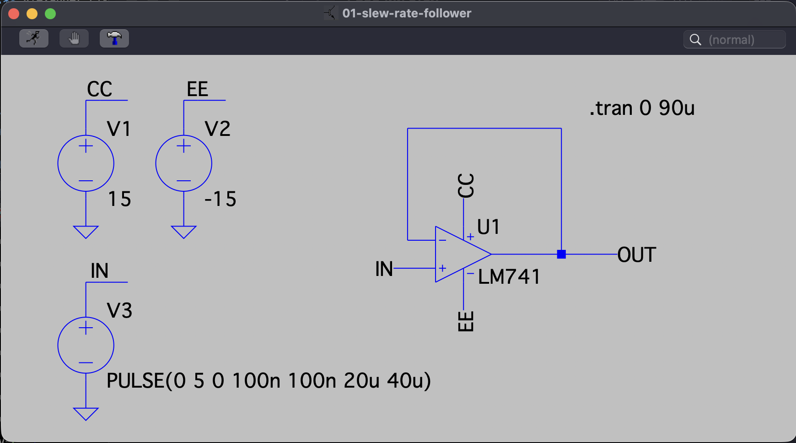  
_LM741 configured as a voltage follower._

---

### Simulation setup

| Parameter       | Value                            | Comment           |
| --------------- | -------------------------------- | ----------------- |
| Input source    | `PULSE(0 5 0 100n 100n 20u 40u)` | Fast 0→5 V step   |
| Supply voltages | ±15 V                            | Typical for LM741 |
| Analysis        | `.tran 0 90u`                    | 90 µs window      |

---

### Simulation result

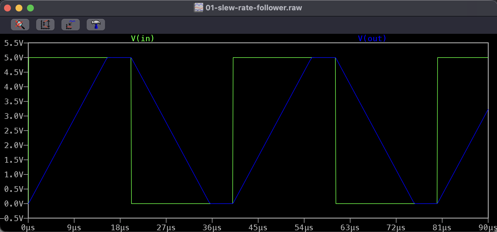  
_Input (green) and output (blue) step response._

Measured from the linear part of $V_{out}$:

$ΔV = 4.85\,\text{V} - 0.30\,\text{V} = 4.55\,\text{V}$  
$Δt = 15\,\text{µs} - 1\,\text{µs} = 14\,\text{µs}$

$\text{Slew Rate} = \dfrac{ΔV}{Δt} = \dfrac{4.55\,\text{V}}{14\,\text{µs}} \approx 0.33\,\text{V/µs}$

**Datasheet (LM741, TI):** 0.5 V/µs typical  
**Comment:** Simulated value is slightly lower, within realistic range (model-dependent).

---

### Measurement

- **Input:** fast rising edge from +5 V (button / wire).
- **Scope setup:** CH A = input, CH B = output.

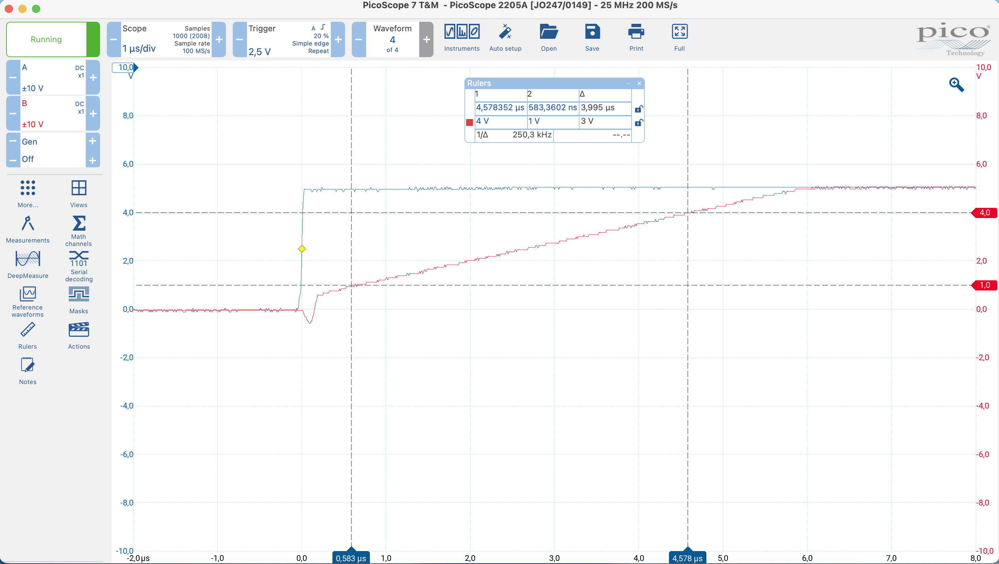  
_Measured slew rate; slope taken from the linear section._

**Measured values:**

$\Delta V = 4\,\text{V} - 1\,\text{V} = 3\,\text{V}$  
$\Delta t = 4.578352\,\text{µs} - 0.5833602\,\text{µs} \approx 3.995\,\text{µs}$

**Result:**

$SR = \dfrac{\Delta V}{\Delta t} = \dfrac{3}{3.995} \approx 0.75\,\text{V/µs}$

**Comment:**  
Measured slew rate ≈ 0.75 V/µs — slightly higher than the typical datasheet value (0.5 V/µs), which is reasonable due to model and measurement tolerances.  
The slope was measured only over the linear rising region, excluding the small initial jump.

## 2) Non-inverting amplifier (Av = 10)

### Given

- **Op-amp:** LM741 (±15 V)
- **Input signal:** $v_{in}(t) = 1\,\text{V}\cdot\sin(\omega t)$

---

### Theory

For a non-inverting amplifier:

$$A_v = 1 + \frac{R_f}{R_i}$$

For the target gain $A_v = 10$:

$$10 = 1 + \frac{R_f}{R_i} \Rightarrow R_f = 9R_i$$

**E12 resistor choice:**

- $R_i = 10\,\text{k}\Omega$
- $R_f = 68\,\text{k}\Omega + 22\,\text{k}\Omega = 90\,\text{k}\Omega$

**Expected gain:**  
$A_v = 1 + \dfrac{90\,\text{k}}{10\,\text{k}} = 10.0$

---

### Schematic

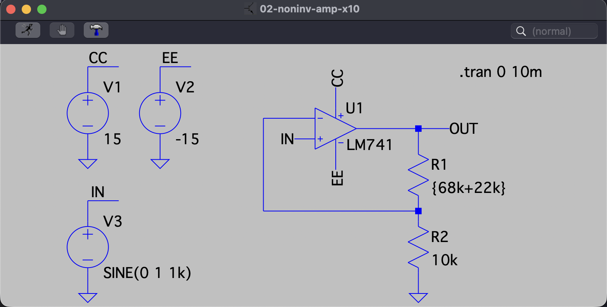  
_LM741 configured as a non-inverting amplifier ($A_v = 10$)._

---

### (a) Basic amplification and saturation

**Simulation setup**

| Parameter       | Value          | Comment                   |
| --------------- | -------------- | ------------------------- |
| Input source    | `SINE(0 1 1k)` | 1 V amplitude, 1 kHz sine |
| Supply voltages | ±15 V          | Typical for LM741         |
| Analysis        | `.tran 0 10m`  | 10 ms window              |

**Simulation result**

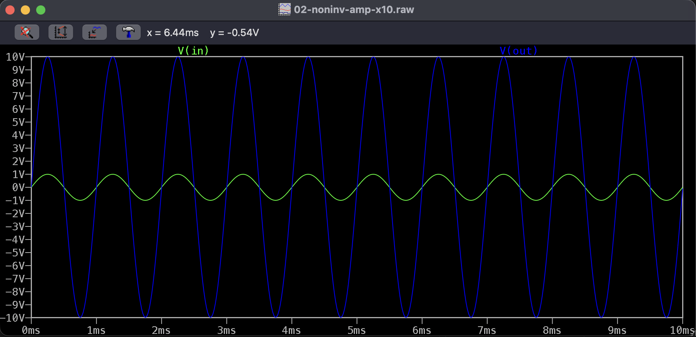  
_Input (green) and output (blue); gain ≈ 10×._

**Saturation (simulation)**

When the input amplitude increases above 1.44 V, the output saturates near ±14 V.

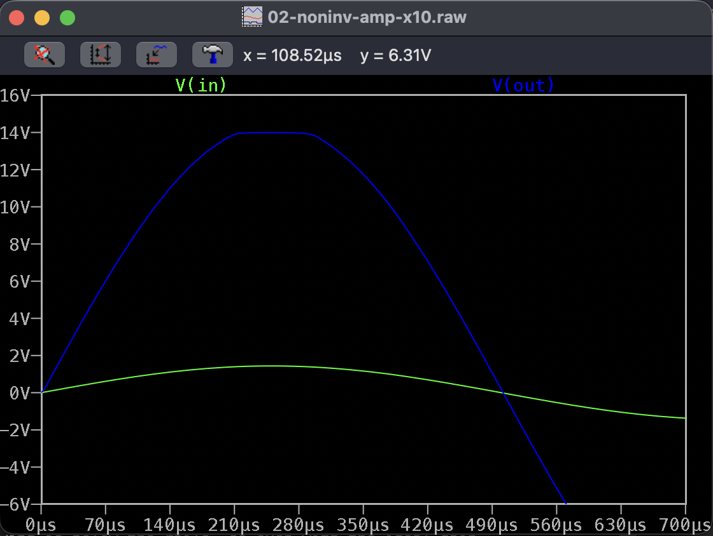  
Saturation starts at $V_{in,pk}\approx1.44\,\text{V}$, $V_{out,pk}\approx14\,\text{V}$.

**Measurement**

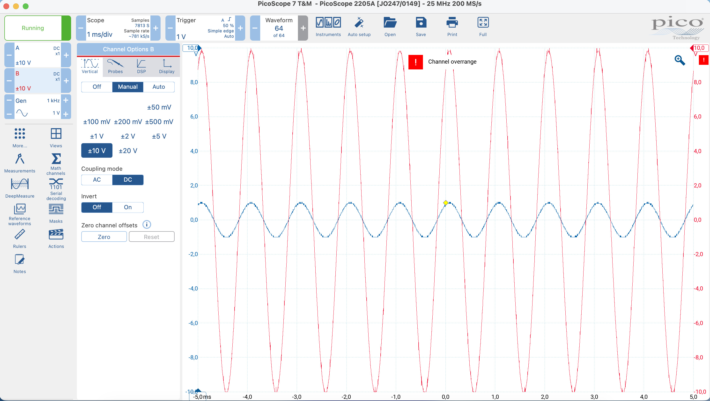  
_CH A (blue) = input (1 V pk), CH B (red) = output (10 V pk). Non-inverted, gain ≈ 10×._

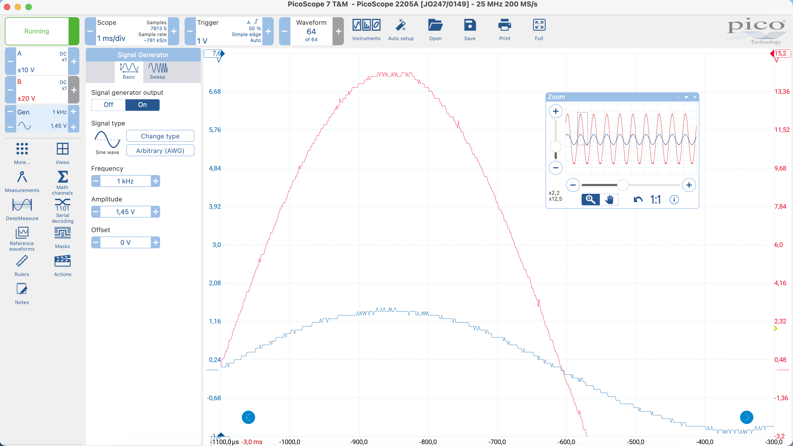  
Clipping begins at $V_{in,pk}\approx1.45\,\text{V}$, $V_{out,pk}\approx14\,\text{V}$.  
Both simulation and measurement show nearly identical saturation thresholds.

---

### (b) Start of amplitude decrease

Increase the input-signal frequency while keeping $V_{in,pk}=1\,\text{V}$ and observe when the output amplitude begins to fall.

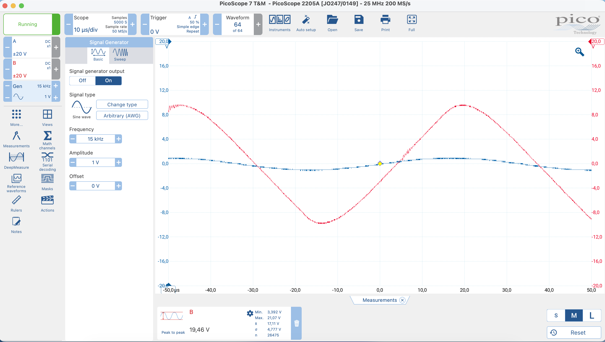  
_At $f\approx15\,\text{kHz}$ the output amplitude starts to decrease from 10 V pk._

**Observation:**  
The gain begins to decline above ≈15 kHz due to the limited bandwidth and slew-rate of the LM741.

---

### (c) Bandwidth measurement (−3 dB point)

**Definition:**  
Cut-off frequency $f_{-3\text{dB}}$ is where $V_{out,pk}=0.71\cdot V_{out,\text{max}}$.

From (a): $V_{out,\text{max}}=10\,\text{V}$ → target $V_{out,-3\text{dB}}=7.1\,\text{V}$.

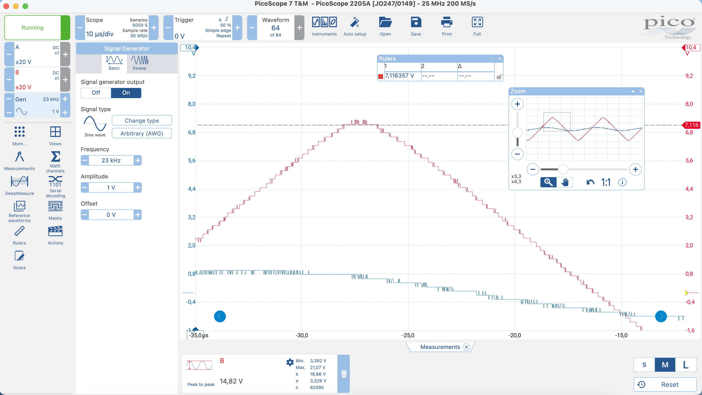  
At $f\approx23\,\text{kHz}$ the output amplitude is ≈7.1 V → $f_{-3\text{dB}}\approx23\,\text{kHz}$.

**Comment:**  
Measured −3 dB bandwidth ≈ 23 kHz, which agrees with the expected large-signal bandwidth for the LM741.

## 3) Inverting amplifier (Av = −10)

### Given

- **Op-amp:** LM741 (±15 V)
- **Goal:** $A_v = -10$
- **Input:** $v_{in}(t) = 1\,\text{V}\cdot\sin(\omega t)$

---

### Theory

$A_v = \dfrac{V_{out}}{V_{in}} = -\dfrac{R_f}{R_{in}}$  
(The minus sign = 180° phase inversion.)

---

### Calculation

$-\dfrac{R_f}{R_{in}} = -10 \Rightarrow R_f = 10\,R_{in}$

**Chosen (E12):**

- $R_{in} = 10\,\text{k}\Omega$
- $R_f = 100\,\text{k}\Omega$
- $A_v = -\dfrac{100\,\text{k}}{10\,\text{k}} = -10$

---

### Schematic

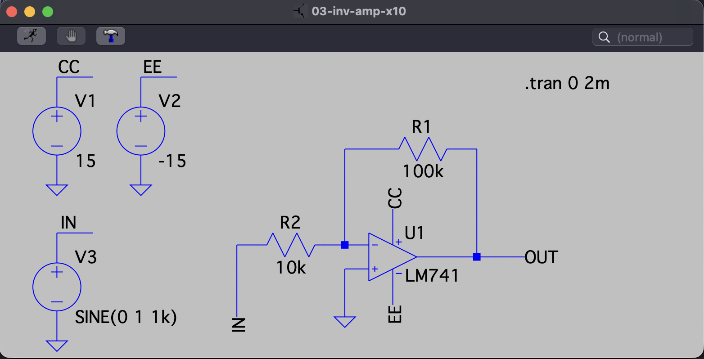  
_LM741 configured as inverting amplifier ($A_v=-10$)._

---

### Simulation setup

| Parameter       | Value          | Comment                   |
| --------------- | -------------- | ------------------------- |
| Input source    | `SINE(0 1 1k)` | 1 V amplitude, 1 kHz sine |
| Supply voltages | ±15 V          | Typical for LM741         |
| Analysis        | `.tran 0 2m`   | 2 ms time window          |

---

### Simulation result

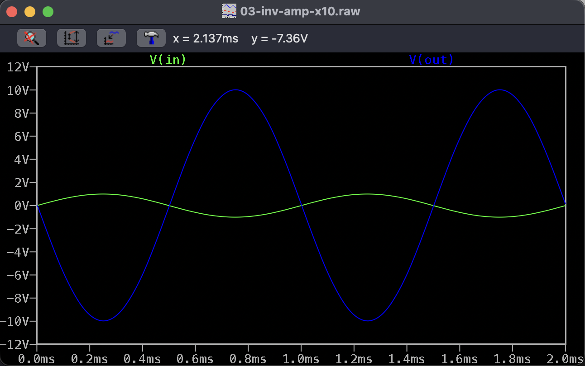  
_Input (green) and output (blue)._

Measured from cursors:  
$A_v=\dfrac{V_{out,pk}}{V_{in,pk}}=\dfrac{10}{1}=10 \;\Rightarrow\;$ **type:** inverting → effective gain $-10$ (180° phase shift).

---

### (a) Output verification — **measurement**

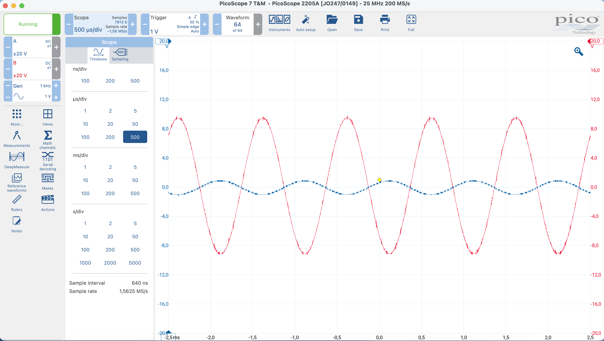  
CH A (blue) = input $1\,\text{V}_{pk}$, CH B (red) = output $10\,\text{V}_{pk}$.  
Waveforms are in anti-phase (180°); gain ≈ 10×.

---

### (b) Start of amplitude decrease — **measurement**

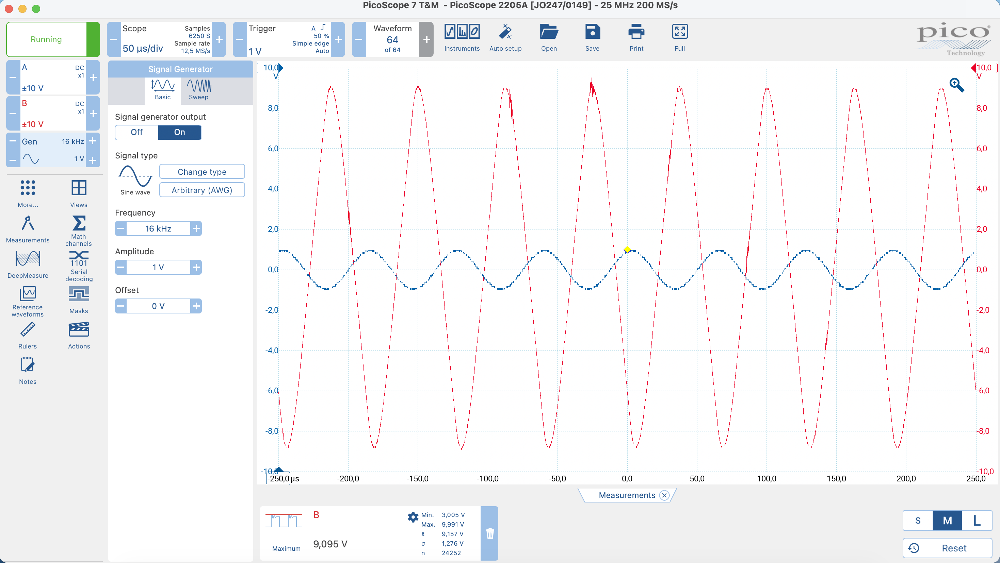  
With $V_{in,pk}=1\,\text{V}$, the output begins to drop from 10 V at $f\approx16\,\text{kHz}$.

**Observation:** Gain roll-off starts near 16 kHz due to bandwidth/slew limits.

---

### (c) Bandwidth (−3 dB point) — **measurement**

Definition: cutoff where $V_{out,pk}=0.71\cdot V_{out,\text{max}}=0.71\cdot10\,\text{V}=7.1\,\text{V}$.

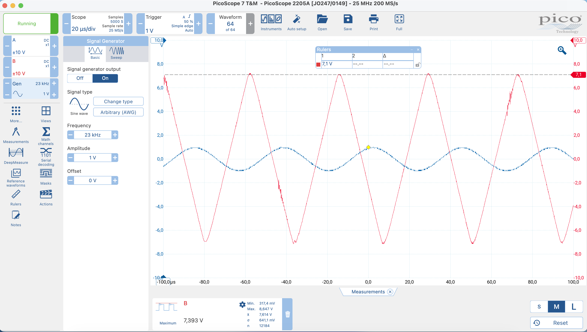  
At $f\approx23\,\text{kHz}$ the output amplitude is ≈ $7.1\,\text{V}$ → $f_{-3\text{dB}}\approx23\,\text{kHz}$.

**Comment:** Measured −3 dB bandwidth ≈ 23 kHz (consistent with large-signal behavior of LM741).

## 4) Inverting summing amplifier

### Given

- **Op-amp:** LM741 (±15 V)
- **Goal:** The output should be the inverted sum of both inputs: $V_o = -1.8\,V_{in1} - 2.5\,V_{in2}$

---

### Theory

The inverting summing amplifier adds multiple input voltages together, each scaled by its own gain factor.  
All input signals are connected through separate resistors to the **inverting input (−)** of the op-amp.  
The **non-inverting input (+)** is connected to ground.  
The output voltage is an inverted, weighted sum of all inputs.

For two inputs, the general formula is:

$V_o = -\left(\dfrac{R_f}{R_1}V_{in1} + \dfrac{R_f}{R_2}V_{in2}\right)$

The minus sign indicates phase inversion (180° shift).  
Each ratio $\dfrac{R_f}{R_i}$ defines how strongly that input affects the output.

---

### Calculation

Target: $V_o = -1.8\,V_{in1} - 2.5\,V_{in2}$

General form: $V_o = -\left(\dfrac{R_f}{R_1}V_{in1} + \dfrac{R_f}{R_2}V_{in2}\right)$

We need: $\dfrac{R_f}{R_1}=1.8,\quad \dfrac{R_f}{R_2}=2.5$

**Choose** $R_f = 18\,\text{k}\Omega$

Then  
$R_1 = \dfrac{R_f}{1.8} = \dfrac{18\,\text{k}\Omega}{1.8} = 10\,\text{k}\Omega$

$R_2 = \dfrac{R_f}{2.5} = \dfrac{18\,\text{k}\Omega}{2.5} = 7.2\,\text{k}\Omega$

Nearest E12 match for $R_2$: $3.9\,\text{k}\Omega + 3.3\,\text{k}\Omega$ (series).

**Achieved gains:**  
$\dfrac{R_f}{R_1} = \dfrac{18\,\text{k}}{10\,\text{k}} = 1.8$

$\dfrac{R_f}{R_2} = \dfrac{18\,\text{k}}{7.2\,\text{k}} = 2.5$

**Final output equation:**  
$V_o = -\big(1.8\,V_{in1} + 2.5\,V_{in2}\big)$

### Schematic

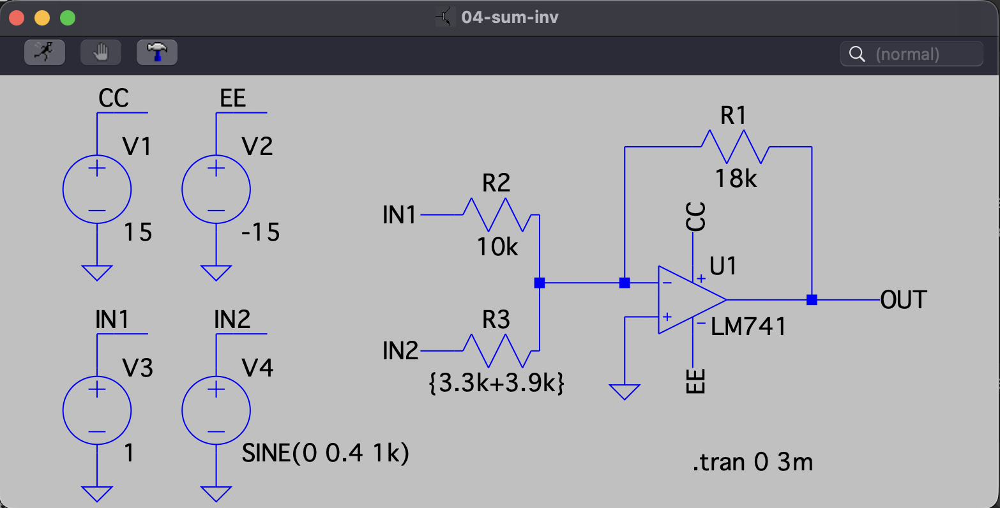  
_LM741 configured as inverting summing amplifier._

### Simulation setup

| Parameter | Value                 | Comment                         |
| --------- | --------------------- | ------------------------------- |
| $R_f$     | $18\,\text{k}\Omega$  | exact weights                   |
| $R_1$     | $10\,\text{k}\Omega$  | for $V_{in1}$                   |
| $R_2$     | $7.2\,\text{k}\Omega$ | for $V_{in2}$ (3.9k+3.3k)       |
| $V_{in1}$ | DC $+1\,\text{V}$     | sets $-1.8$ V offset            |
| $V_{in2}$ | `SINE(0 0.4 1k)`      | $2.5\cdot0.4=1.0$ Vpk at output |
| Supplies  | ±15 V                 | LM741                           |
| Analysis  | `.tran 0 3m`          | 3 ms window                     |

### Simulation result

$V_o(t) = -1.8 - 1.0\sin(2\pi\cdot 1\,\text{kHz}\cdot t)$

- DC level: $-1.8\,\text{V}$
- AC amplitude: $1.0,\text{V}_{pk}$ (inverted)
- Peaks: $V_{\max}\approx -0.8\,\text{V}$, $V_{\min}\approx -2.8\,\text{V}$

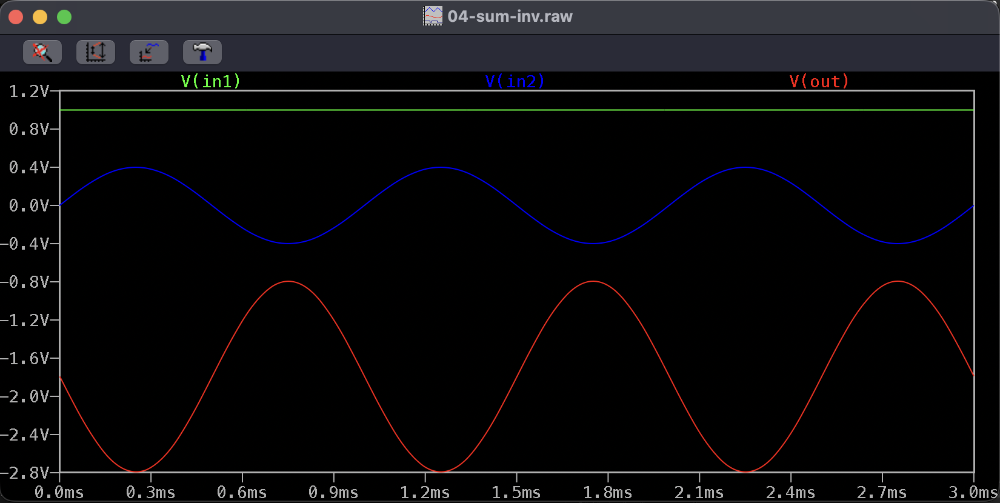  
_Output shows an inverted sine wave (1 V pk) with a DC offset of −1.8 V._

### Measurement

**Setup note:** To get the required DC input of $+1.00\,\text{V}$ from the bench $+5\,\text{V}$ rail, a **10 kΩ potentiometer** was used as a divider (ends to +5 V and GND, wiper → $V_{in1}$). Adjusted the wiper until $V_{in1}\approx+1.00\,\text{V}$ (verified with the scope/DC meter).

**PicoScope channels:**

- **CH A (blue)** — $V_{in2}$: `sine`, $0.4\,\text{V}_{pk}$ @ $1\,\text{kHz}$
- **CH B (red)** — $V_o$ (amplifier output)

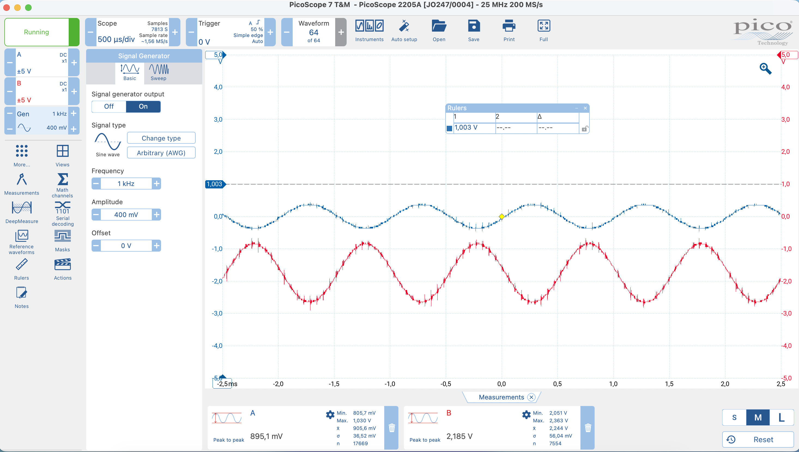  
_CH A = input AC (0.4 Vₚₖ @ 1 kHz); CH B = inverted output Vₒ with −1.8 V offset._

**Observed:**

- Output DC offset ≈ **−1.8 V** (matches $-1.8\cdot V_{in1}$ with $V_{in1}\approx+1.0\,\text{V}$).
- Output AC amplitude ≈ **1.0 V_pk**, inverted wrt $V_{in2}$ (matches $2.5\cdot0.4=1.0\,\text{V\_pk}$).
- Peaks: $V_{\max}\approx-0.8\,\text{V}$, $V_{\min}\approx-2.8\,\text{V}$, consistent with simulation.

## 5) Non-inverting summing amplifier

### Given

- **Op-amp:** LM741 (±15 V)
- **Goal:** $V_o = 3\cdot V_{s1} + 4\cdot V_{s2}$

---

### Theory

A non-inverting summing amplifier adds two input voltages together without inverting their phase.  
Both sources are connected to the **non-inverting (+)** input through a resistor network that creates a weighted average.  
The **inverting (−)** input forms a feedback divider that sets the overall gain.

$V_o=\left(1+\dfrac{R_4}{R_3}\right)\dfrac{V_{s1}R_2+V_{s2}R_1}{R_1+R_2}$

---

### Calculation (step-by-step)

**Goal:** $V_o = 3\,V_{s1} + 4\,V_{s2}$

**Standard form (non-inverting summer):**  
$V_o = \left(1+\dfrac{R_4}{R_3}\right)\dfrac{V_{s1}R_2 + V_{s2}R_1}{R_1 + R_2}$

Let’s simplify it by defining:  
$K = 1 + \dfrac{R_4}{R_3}$, $a = \dfrac{R_2}{R_1 + R_2}$, $b = \dfrac{R_1}{R_1 + R_2}$

So:  
$V_o = K(aV_{s1} + bV_{s2})$

---

We need:
$K\,a = 3$ and $K\,b = 4$

To find the relationship between $a$ and $b$, divide one by another:  
$\dfrac{K\,a}{K\,b} = \dfrac{3}{4} \Rightarrow \dfrac{a}{b} = \dfrac{3}{4}$

This means that $a$ and $b$ keep the same 3:4 ratio as the desired output coefficients.

Also, since both resistors $R_1$ and $R_2$ form a divider,  
$a + b = \dfrac{R_2}{R_1 + R_2} + \dfrac{R_1}{R_1 + R_2} = 1$

---

Now solve the two equations:  
$a + b = 1$ and $\dfrac{a}{b} = \dfrac{3}{4}$

$\Rightarrow a = \dfrac{3}{7},\ b = \dfrac{4}{7}$

---

From $K\,a = 3$ and $a = \dfrac{3}{7}$:

$K = \dfrac{3}{a} = \dfrac{3}{\frac{3}{7}} = 7$

Check with $K\,b = 4$ and $b = \dfrac{4}{7}$:

$K = \dfrac{4}{b} = \dfrac{4}{\frac{4}{7}} = 7$

Both give $K = 7$

---

**Select resistor ratios (E12):**

$a = \dfrac{R_2}{R_1 + R_2} = \dfrac{3}{7}$ → $R_2:R_1 = 3:4$ → choose $R_1 = 40\,\text{k}\Omega$, $R_2 = 30\,\text{k}\Omega$

$K = 1 + \dfrac{R_4}{R_3} = 7$ → $\dfrac{R_4}{R_3} = 6$ → choose $R_3 = 10\,\text{k}\Omega$, $R_4 = 60\,\text{k}\Omega$

---

**Verification:**

$a = \dfrac{30}{40 + 30} = \dfrac{3}{7}$

$b = \dfrac{40}{40 + 30} = \dfrac{4}{7}$

$K = 1 + \dfrac{60}{10} = 7$

$\Rightarrow V_o = 7\left(\dfrac{3}{7}V_{s1} + \dfrac{4}{7}V_{s2}\right) = 3V_{s1} + 4V_{s2}$

---

**Final resistor set:**
$R_1 = 40\,\text{k}\Omega,\ R_2 = 30\,\text{k}\Omega,\ R_3 = 10\,\text{k}\Omega,\ R_4 = 60\,\text{k}\Omega$

**Practical resistor options (E12 series):**

- $R_1$: 22 kΩ + 18 kΩ (≈ 40 kΩ)
- $R_2$: 15 kΩ + 15 kΩ (= 30 kΩ)
- $R_3$: 10 kΩ (single)
- $R_4$: 33 kΩ + 27 kΩ (≈ 60 kΩ)
  Keep resistor ratios close to calculated values for correct gain.

**Result:**
$V_o = 3\,V_{s1} + 4\,V_{s2}$ (non-inverting, in phase)

### Schematic

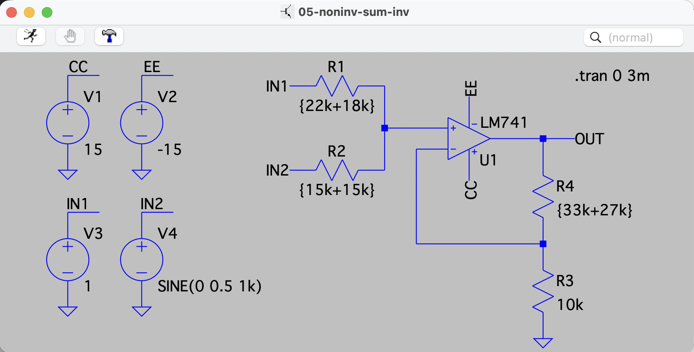  
_LM741 configured as non-inverting summing amplifier._

---

### Simulation setup

| Parameter | Value                |
| --------- | -------------------- |
| $R_1$     | $40\,\text{k}\Omega$ |
| $R_2$     | $30\,\text{k}\Omega$ |
| $R_3$     | $10\,\text{k}\Omega$ |
| $R_4$     | $60\,\text{k}\Omega$ |
| $V_{s1}$  | DC $+1\,\text{V}$    |
| $V_{s2}$  | `SINE(0 0.5 1k)`     |
| Analysis  | `.tran 0 3m`         |

### Simulation result

$V_o(t) = 3 + 2\sin(2\pi\cdot1\,\text{kHz}\cdot t)$

- DC level: $+3\,\text{V}$
- AC amplitude: $2\,\text{V}_{pk}$ (in phase with $V_{s2}$)
- Range: $V_{\min}\approx 1\,\text{V}$, $V_{\max}\approx 5\,\text{V}$

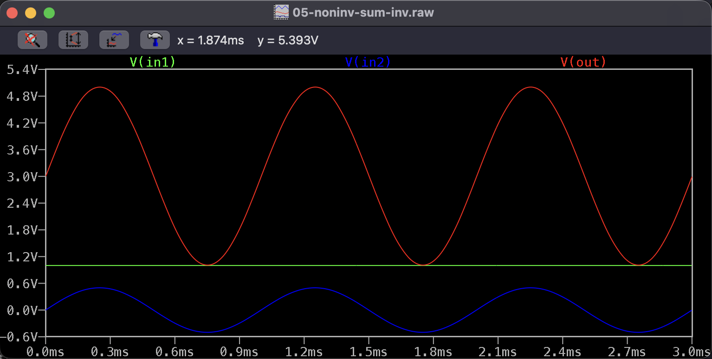  
Output shows a 2 V sine wave (red) centered at +3 V. Inputs: $V_{s1}$ (DC 1 V, green) and $V_{s2}$ (AC 0.5 V, blue).

### Measurement

**PicoScope setup**

- **CH A (blue)** — $V_{s2}$: sine, $0.5\,\text{V}_{pk}$ @ $1\,\text{kHz}$
- **CH B (red)** — $V_o$: amplifier output
- **DC marker (ruler)** — shows $V_{s1}\approx +1.00\,\text{V}$ (DC input)

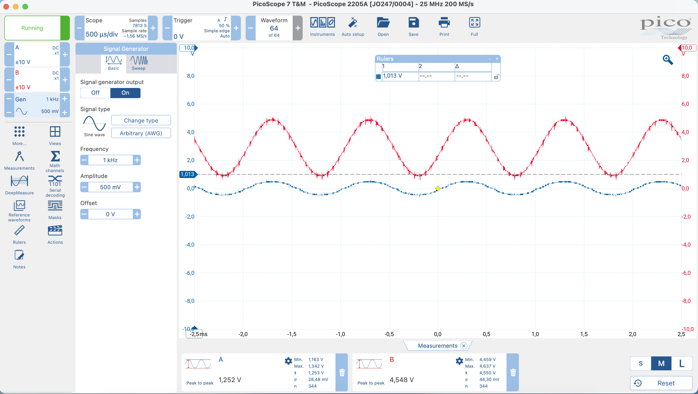  
CH A = input sine $V_{s2}$; CH B = output $V_o$. Cursor line indicates DC input $V_{s1}\approx 1.0\,\text{V}$.

**Observed:**

- Output DC offset ≈ $+3.0\,\text{V}$ (matches $3\cdot V_{s1}$)
- Output AC amplitude ≈ $2.0\,\text{V}_{pk}$ (matches $4\cdot 0.5$)
- Range: $V_{\min}\approx 1\,\text{V}$, $V_{\max}\approx 5\,\text{V}$
- Phase: $V_o$ is **in phase** with $V_{s2}$ (non-inverting)

**Conclusion:**  
Measured output agrees with the target transfer $V_o = 3\,V_{s1} + 4\,V_{s2}$ within component tolerances.

---

## 6) Signal Level Adjustment for ESP32-C6

### Given

- **Input signal:** sine wave, ±2 V amplitude (4 V pp), period = 10 ms → $f = 100\,\text{Hz}$
- **Op-amp:** LM741 (±15 V supply)
- **Goal:** Shift and scale the input signal so that the ESP32-C6 (ADC range $0\ldots3.3\,\text{V}$) can read it safely.

---

### Theory

The ESP32-C6 ADC can read only between **0 V** and **3.3 V**.
Voltages below 0 V can turn on protection diodes and harm the pin.
So we must shift the signal up (add a DC offset) and scale it down so it stays within
$0\ldots3.3\,\text{V}$.

We seek a linear transformation:
$V_{out} = k \cdot V_{in} + V_{off}$

where $k$ is the scaling factor and $V_{off}$ is the DC offset.

---

### Calculation

Map $V_{in}\in[-2,+2]\,\text{V}$ to $V_{out}\in[0,3.3]\,\text{V}$:

$V_{off} = \dfrac{0 + 3.3}{2} = 1.65\,\text{V}$

$k = \dfrac{3.3/2}{2} = 0.825$

Desired transfer:
$V_{out}(t) = 0.825\,V_{in}(t) + 1.65$

**Check:** If $V_{in}=\pm2\,\text{V}$ → $V_{out}\approx 0\,\text{V}$ / $3.3\,\text{V}$.

---

### Implementation (non-inverting summer on LM741)

**Standard form (non-inverting summer):**

$$
V_{out}=\Big(1+\frac{R_4}{R_3}\Big)\,\frac{V_{ref}\,R_1+V_{in}\,R_2}{R_1+R_2}
$$

Define: $K=1+\dfrac{R_4}{R_3}$, $b=\dfrac{R_1}{R_1+R_2}$ (DC weight), $a=\dfrac{R_2}{R_1+R_2}$ (AC weight).

Then $V_{out}=K\,(b\,V_{ref}+a\,V_{in})$.

**Target conditions:**

- Offset: target midpoint $V_{out,DC}\approx 1.65\,\text{V}$
- Scale: target $k\approx0.825$ so that $V_{in}=\pm2\,\text{V}$ maps to $V_{out}\approx 0\ldots3.3\,\text{V}$

With practical E12 resistor values (and a potentiometer for $V_{ref}$), the exact ratios are approximate.
Therefore, $V_{ref}$ was adjusted in the lab so that the **measured output midpoint** is $\approx 1.65\,\text{V}$, and the output swing stayed within $\approx 0\ldots3.3\,\text{V}$ (see measurement).

---

### Components (resistors)

| Ref | Value | Where it connects                        | Purpose                     |
| --- | ----- | ---------------------------------------- | --------------------------- |
| R1  | 10 kΩ | Vref (DC, adjusted) → non-inv. input (+) | Weight for DC offset $b$    |
| R2  | 12 kΩ | Vin (AC ±2 V) → non-inv. input (+)       | Weight for AC input $a$     |
| R3  | 12 kΩ | (−) input → GND                          | Feedback divider (sets $K$) |
| R4  | 10 kΩ | Vout → (−) input                         | Feedback divider (sets $K$) |

---

### Simulation setup

| Parameter | Value           | Comment         |
| --------- | --------------- | --------------- |
| $V_{in}$  | `SINE(0 2 100)` | ±2 V, 100 Hz    |
| $V_{ref}$ | `DC 1.65`       | from 5 V DC     |
| Supplies  | ±15 V           | LM741           |
| Analysis  | `.tran 0 50m`   | several periods |

---

### Simulation result

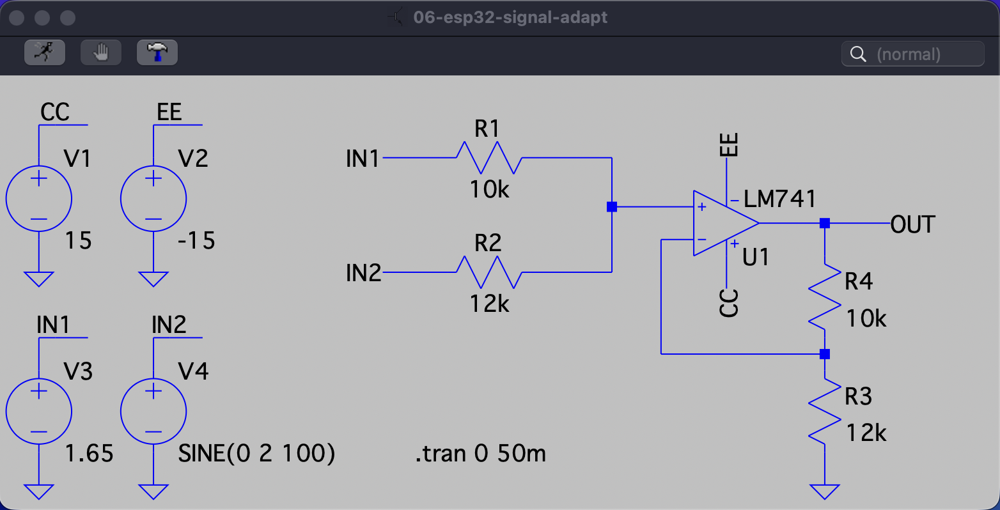  
_LM741 configured as level shifter and scaler for ESP32-C6 input._

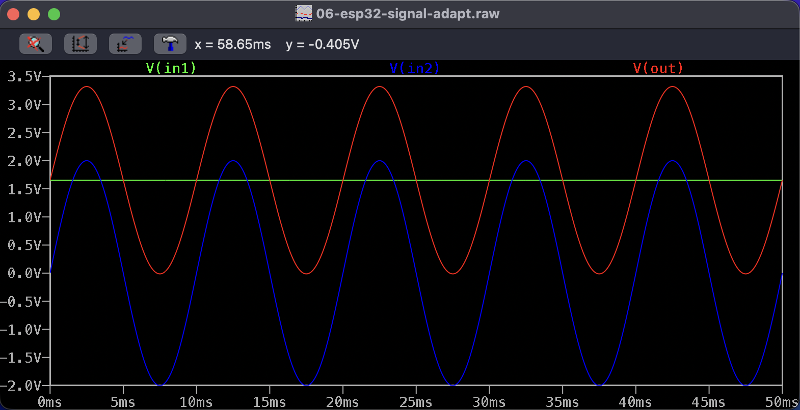  
_**DC in** (green, 1.65 V), **AC in** \(V_in\) (blue, ±2 V @ 100 Hz), **AC out** \(V_out\) (red, 0…3.3 V)._

### Measurement

**Setup note:**  
A **1 kΩ potentiometer** was used to generate an adjustable DC reference voltage ($V_{ref}$) from the +5 V supply. $V_{ref}$ was adjusted until the measured output midpoint was $\approx 1.65\,\text{V}$ (see scope marker).  
This low resistance value ensured that the pot did not noticeably affect the circuit operation or the input impedance of the op-amp.

**PicoScope setup**

- **CH A (blue)** — input AC signal: ±2 V (4 V pp), 100 Hz
- **CH B (red)** — output after scaling and level-shifting (expected 0…3.3 V)
- Horizontal marker — shows the measured output midpoint (≈ 1.65 V)

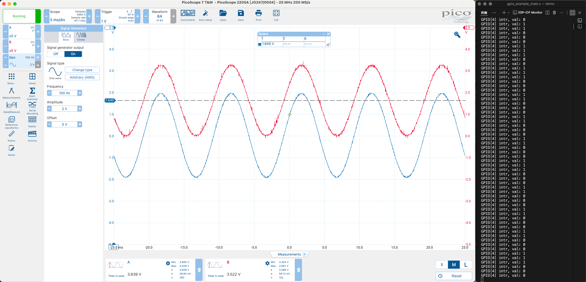  
_CH A = input AC; CH B = output (0…3.3 V). A marker indicates 1.65 V DC offset._

**Observation:**  
The output waveform is shifted and scaled correctly —  
range ≈ 0 V to 3.3 V, centered at 1.65 V, matching the ESP32-C6 ADC input range.

On the right side of the screen, the connected **ESP32-C6** can be seen reacting to this waveform:  
it correctly detects logic **“1” and “0” transitions** as the signal crosses its internal threshold near **1.65 V**, confirming that the adjusted signal is valid for digital or ADC input.

**Conclusion:**  
The circuit successfully shifts and scales the ±2 V input into the 0–3.3 V range required by the ESP32-C6, confirming correct operation in both simulation and measurement.
