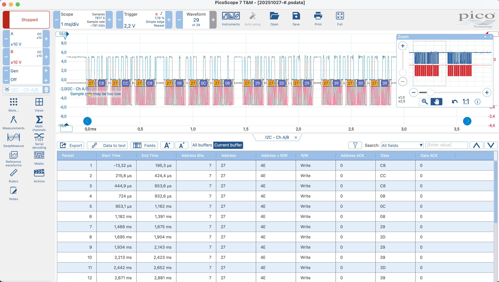
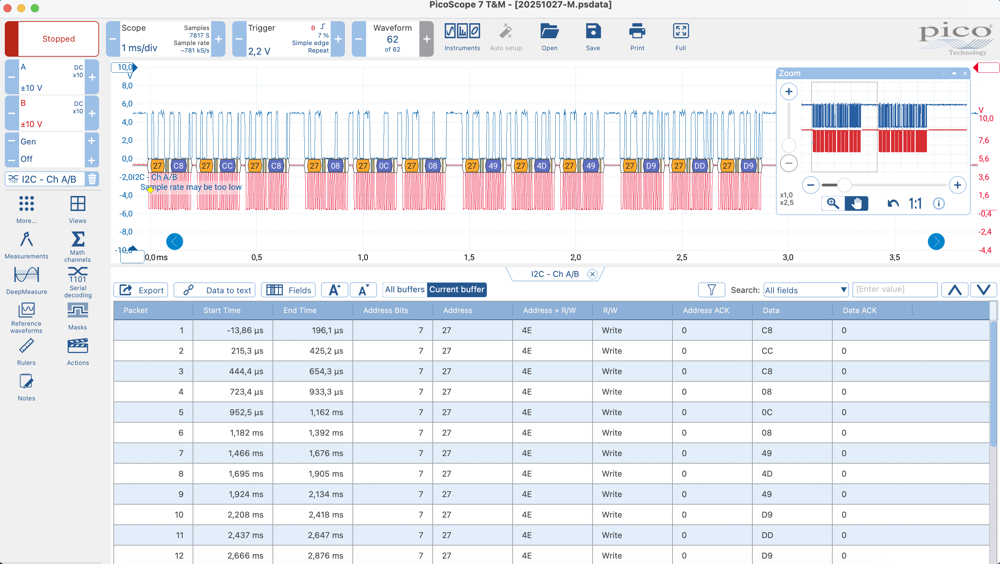

# I2C LCD Hacking

**Topic:** Inter-Integrated Circuit (I²C) bus and LCD control via PCF8574  
**Tools:** Arduino Uno, LCD 16x2 with I²C interface, Oscilloscope PicoScope 2205A

---

## Hardware setup

| Connection | Arduino Uno Pin |
| ---------- | --------------- |
| SDA        | A4              |
| SCL        | A5              |
| VCC        | 5V              |
| GND        | GND             |

The oscilloscope was connected to **SCL**, **SDA**, and **GND** to observe bus signals.

---

## Notes

- The LCD uses the **HD44780** controller internally.
- The **PCF8574** acts as an I²C-to-parallel expander for this controller.
- This reduces the required connections from 7–11 wires down to only 2 (SDA, SCL).

---

## Question 1

**A:** What is the I²C address range of PCF8574?

The PCF8574 has a **fixed address prefix** and **three configurable bits (A2–A1–A0)**, which are set in hardware using solder jumpers or wiring on the module.

The 7-bit I²C address format is:

```
0100 A2 A1 A0
```

In binary, this gives the range:

```
0100 000 → 0x20 (32)
to
0100 111 → 0x27 (39)
```

**I²C address range: 0x20–0x27**

---

**B:** How to set the address (within address range)?

The I²C address of the PCF8574 is configured using the three hardware pins **A0**, **A1**, and **A2**.  
Each of these pins can be connected either to **GND (logic 0)** or **VCC (logic 1)**.  
This combination defines the lower three bits of the 7-bit address, allowing eight unique addresses from 0x20 to 0x27.

| A2  | A1  | A0  | I²C Address |
| --- | --- | --- | ----------- |
| 0   | 0   | 0   | 0x20        |
| 0   | 0   | 1   | 0x21        |
| 0   | 1   | 0   | 0x22        |
| 0   | 1   | 1   | 0x23        |
| 1   | 0   | 0   | 0x24        |
| 1   | 0   | 1   | 0x25        |
| 1   | 1   | 0   | 0x26        |
| 1   | 1   | 1   | 0x27        |

On many I²C LCD modules, these pins appear as **solder jumpers (A0–A2)** on the small backpack board.  
By soldering or leaving them open, you can set the desired address manually.

---

**C:** How many PCF8574's can be connected to the same I²C bus?

Each PCF8574 has three address selection pins (**A0, A1, A2**), allowing eight unique address combinations (from **0x20 to 0x27**).  
Therefore, up to **8 PCF8574 devices** can be connected to the same I²C bus at once, as long as each device uses a unique address configuration.

---

## Capture 1 — Secret character "#"



This capture shows the I²C communication when the secret character `#` was sent to the display.

## Question 2

In the I²C protocol, the address frame has 8 bits:

[A6 A5 A4 A3 A2 A1 A0 | R/W]

- **A6–A0** → 7-bit device address
- **R/W** → 0 = Write, 1 = Read

---

**A:** What was the I2C address? Give your answer both in binary and hex

The oscilloscope data showed address **27|...**, which means the device address is **0x27**.  
This matches the address of the LCD module, which is also defined in the Arduino code:

```cpp
LiquidCrystal_I2C lcd = LiquidCrystal_I2C(0x27, 16, 2);
```

**I²C address:**

- **Binary (7-bit):** 0100 111
- **Hex:** 0x27

---

**B:** Was it read or write address?

It was a **write** address.  
Combining the 7-bit address **0x27** with the R/W bit = 0 gives the transmitted byte **0x4E** (`0100 1110`).  
The last bit `0` indicates a **write** operation from the Arduino to the LCD module.

---

**C:** What was the data value? Give your answer both in binary and hex

From the oscilloscope capture, the transmitted data bytes were grouped as follows:

```
C8 CC C8
08 0C 08
29 2D 29 -> 0x2 (data upper)
39 3D 39 -> 0x3 (data lower)
```

The first two groups form the command (`0xC0`) to set the cursor position,  
and the last two groups contain the actual data bytes representing the character `#`.

Combining the upper nibble (`0x2`) and the lower nibble (`0x3`) gives the final data value:

| Type | Upper nibble | Lower nibble | Full byte | Meaning          |
| ---- | ------------ | ------------ | --------- | ---------------- |
| Data | 0x2          | 0x3          | **0x23**  | ASCII symbol `#` |

**Data value:**

- **Binary:** 0010 0011
- **Hex:** 0x23

---

**D:** What is the clock frequency of the I²C bus?

From the oscilloscope measurement, the SCL line frequency was about **66.26 kHz**.  
This means the clock period is around **15 µs**, using the formula $f = \frac{1}{T}$.

---

## Question 3

What are the lines in the source code that are causing

**A:** The first “something”?

The first “something” on the oscilloscope is caused by the following lines in the source code:

```cpp
lcd.setCursor(0, 1);
lcd.print("#");
```

These commands set the cursor to the beginning of the second line and print the secret character `#`.

---

**B:** The second “something”?

```cpp
lcd.setCursor(0, 1);
lcd.print(" ");
```

This command overwrites the secret character with a blank space, clearing it from the display.

---

**C:** The gap between them?

```cpp
delay(1);
```

This causes a short 1 ms pause between writing the secret and clearing it.

---

**D:** Which one contains the secret?

The **first “something”** contains the secret, because it includes the lcd.print("#"); command that sends the ASCII code 0x23 (the character #) to the LCD.

---

## Capture 2 — Secret character



This capture shows the I²C communication when the secret character was sent to the display.

> _All answers below refer to the secret character._

## Questions

**A:** What were the address values of all giraffes?

All 12 “giraffes” had the same 7-bit I²C address **0x27**.
On the bus, this appears as the 8-bit value **0x4E** (`R/W = 0`, write mode).

---

**B:** What was the data pattern (12 bytes, in Hex)?

```
C8  CC  C8 | 08  0C  08 | 49  4D  49 | D9  DD  D9
```

---

## Final Questions

**A:** What was your secret letter?

| Peanuts | Bytes (Hex) | Meaning            | Nibble (Hex) | Binary (4-bit) | Combined (8-bit) | Result                   |
| :-----: | :---------- | :----------------- | :----------- | :------------- | :--------------- | :----------------------- |
|    1    | C8 CC C8    | Command upper part | 0xC          | 1100           |                  |                          |
|    2    | 08 0C 08    | Command lower part | 0x0          | 0000           | 1100 0000        | 0xC0 (Set DDRAM address) |
|    3    | 49 4D 49    | Data upper part    | 0x4          | 0100           |                  |                          |
|    4    | D9 DD D9    | Data lower part    | 0xD          | 1101           | **0100 1101**    | **0x4D (ASCII ‘M’)**     |

The secret letter was **‘M’**, corresponding to:

- **Binary:** `0100 1101`
- **Hex:** `0x4D`
- **ASCII:** `M`

---

**B:** Where’s the fish?

The “fish” (secret character) is shown at the **first column (0)** of the **second line (1)** of the LCD.
This is defined by the command `lcd.setCursor(0, 1)` in the code.

Internally, the LCD controller (HD44780) stores characters in **DDRAM (Display Data RAM)**:
addresses **0x00–0x0F** correspond to the first line, and **0x40–0x4F** to the second line.

The library converts this into the instruction byte **0xC0** = **[1][0x40]**,
where the MSB (=1) indicates the “Set DDRAM address” command,
and the remaining 7 bits (**0x40**) define the address itself — the start of the second line.
